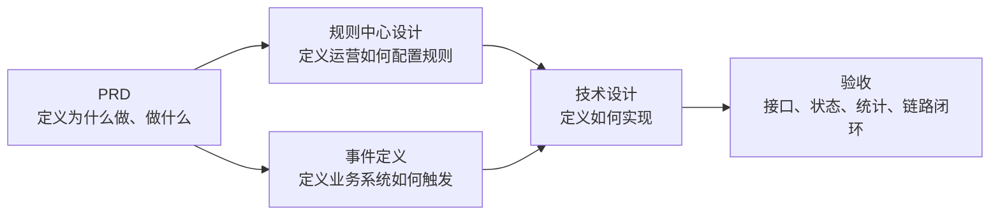

# 文档地图

## 文档清单

| 文件 | 页数 | 定位 | 重点内容 |
| --- | ---: | --- | --- |
| `短信触达平台 V1 PRD.pdf` | 11 | 产品需求 | 背景目标、注册转化、会员召回、活动通知、售后回访、产品设计、验收标准 |
| `短信触达平台 V1 - 规则中心设计.pdf` | 6 | 规则配置说明 | 规则列表/详情/创建/编辑、规则字段、示例规则、执行流程、V1 限制 |
| `短信触达平台 V1 - 事件定义文档.pdf` | 4 | 业务事件契约 | 标准事件结构、用户注册、会员过期、活动开始、订单完成、事件来源 |
| `短信触达平台 V1 技术设计文档.pdf` | 17 | 技术方案 | 系统模块、核心流程、数据库表、API、规则执行、状态机、短链、统计、幂等、合规、排期 |
| `aliyun-sms-test-config.md` | - | 测试短信配置 | 阿里云测试通道、签名、模板、白名单、环境变量、发送前校验 |
| `backend-mvp-design.md` | - | 后端 MVP 设计 | 第一阶段后端范围、接口、数据模型、Provider、SDK 接入、验收标准 |
| `database-docker-prisma.md` | - | 数据库运行说明 | Docker PostgreSQL、Prisma migration、seed、验证命令 |
| `environment-and-startup.md` | - | 环境配置与启动说明 | Node、Docker、环境变量、首次启动、日常启动、worker、验证命令 |
| `implementation-coverage.md` | - | 实现覆盖说明 | 当前代码相对 V1 文档的覆盖情况、测试版处理方式和后续生产化事项 |

## 按角色阅读

| 角色 | 必读 | 关注点 |
| --- | --- | --- |
| 产品/运营 | PRD、规则中心设计、项目摘要 | 业务场景、规则配置、指标口径、V1 不做内容 |
| 后端 | 技术设计、事件定义、规则中心设计、环境配置与启动说明、数据库运行说明 | 事件接收、规则匹配、任务生成、短信服务商、回执、短链、幂等、数据库迁移 |
| 前端 | PRD、规则中心设计、技术设计 API 部分 | 模板管理、规则管理、手动发送、发送记录、统计页 |
| 测试 | PRD、规则中心设计、事件定义、技术设计验收标准 | 四类事件、规则触发、状态流转、短链点击、统计口径 |
| 运维/安全 | 技术设计、环境配置与启动说明 | 部署建议、日志、失败处理、手机号脱敏、批量发送限制、worker 开关 |
| 短信联调 | 阿里云短信测试配置、技术设计 | 测试签名、模板参数、白名单、OpenAPI 返回记录 |
| MVP 开发 | 环境配置与启动说明、后端 MVP 设计、数据库运行说明、阿里云短信测试配置 | mock 默认通道、SDK Provider、发送日志、基础统计、数据库启动 |

## 推荐阅读路径

### 产品和运营

1. `短信触达平台 V1 PRD.pdf`
2. `短信触达平台 V1 - 规则中心设计.pdf`
3. [项目摘要](project-summary.md) 中的 V1 范围、业务场景、验收标准

### 开发实现

1. [项目摘要](project-summary.md)
2. [环境配置与启动说明](environment-and-startup.md)
3. [后端 MVP 设计](backend-mvp-design.md)
4. [数据库与本地 Docker 环境](database-docker-prisma.md)
5. [阿里云短信测试配置](aliyun-sms-test-config.md)
6. `短信触达平台 V1 技术设计文档.pdf`
7. `短信触达平台 V1 - 事件定义文档.pdf`
8. `短信触达平台 V1 - 规则中心设计.pdf`

### 测试验收

1. [项目摘要](project-summary.md) 中的验收标准
2. PRD 的业务验收标准
3. 技术设计的第 17 节验收标准
4. 事件定义和规则中心设计中的 V1 支持范围

## 文档关系

## 维护建议

- PDF 作为原始版本保留，不建议直接改名或移动。
- 新增需求、接口变更、字段变更优先同步到 Markdown 摘要，再回写正式设计文档。
- 如进入 V2，建议新增 `v2-scope.md`，单独沉淀用户分群、AB 实验、营销旅程、转化归因等能力。
