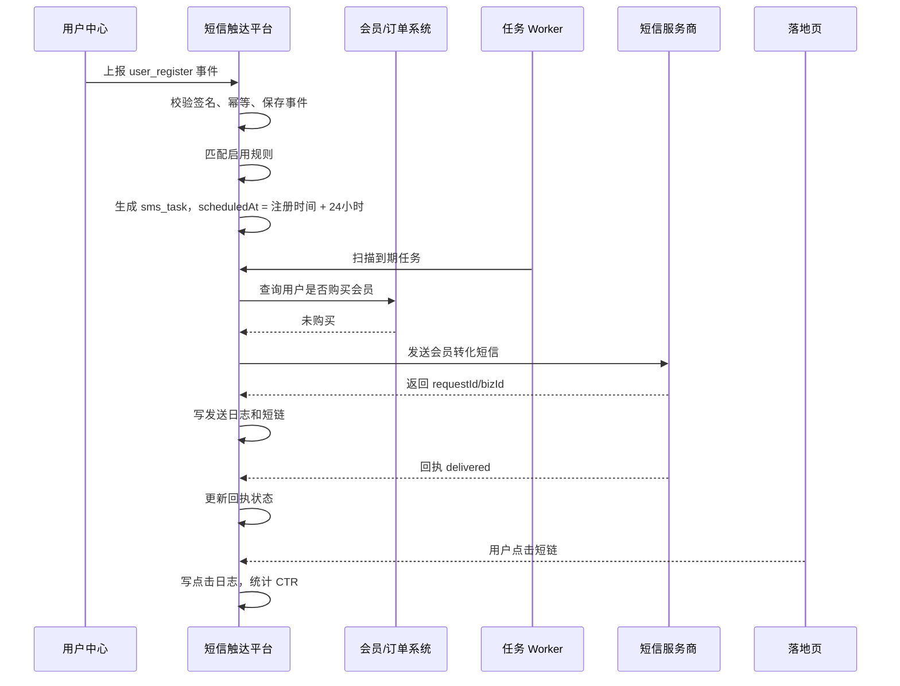

# 能力梳理、核心路线图与线上事件联动

本文档用于说明当前短信触达平台已经具备的能力、后续应扩展的方向，以及如何与线上业务系统联动。重点场景以“用户注册后未购买会员，延迟发送转化短信”为例。

## 当前已经具备的能力

| 能力 | 当前状态 | 说明 |
| --- | --- | --- |
| 管理后台 | 已具备 | React + TypeScript 实现运营工作台，包含总览、模板、规则、手动发送、事件、任务、发送记录 |
| 短信模板管理 | 已具备 | 支持模板列表、新建、启用、停用，模板关联服务商模板 Code |
| 规则中心 | 已具备 | 支持按事件类型配置自动触达规则，包含延迟时间、条件类型、短信模板 |
| 事件接收 | 已具备 | 支持 `user_register`、`membership_expired`、`campaign_start`、`order_completed` 四类事件 |
| 事件幂等 | 已具备 | `eventId` 唯一，重复事件会被拒绝，避免重复生成任务 |
| 任务队列 | 已具备 | 已有 `sms_task` 表，支持 `pending`、`sending`、`success`、`failed`、`blocked` 状态 |
| 到期执行 | 已具备 | 支持 `POST /api/tasks/run-due` 手动扫描，也支持可选内置 worker 周期扫描 |
| 条件判断 | 已具备第一版 | 支持结构化 `conditionConfig`，任务发送前可执行 `not_purchased_membership` 二次校验 |
| 防误发 | 已具备 | 默认 `mock`；真实通道只允许白名单；worker 默认关闭；真实通道 worker 需额外确认 |
| 短信 Provider | 已具备测试版 | 默认 mock；可切换阿里云号码认证 `dypnsapi SendSmsVerifyCode` |
| 发送记录 | 已具备 | 记录触发方式、场景、模板、规则、事件、手机号脱敏、服务商返回 |
| 短链追踪 | 已具备 | 发送成功生成短链，访问短链写入点击日志并跳转 |
| 回执接收 | 已具备 | 支持服务商回调写入回执并更新发送日志 |
| 效果统计 | 已具备 | 展示发送量、成功量、失败量、拦截量、任务量、点击量、CTR |
| 本地数据库 | 已具备 | Docker PostgreSQL + Prisma migration + seed |

## 当前最重要的缺口

| 优先级 | 缺口 | 为什么重要 |
| --- | --- | --- |
| P0 | 线上事件接入安全 | 线上系统调用事件 API 需要签名、密钥、时间戳、重放保护，否则不能放到生产环境 |
| P0 | 事件来源管理 | 需要管理用户中心、会员中心、订单中心等来源系统的密钥、状态和接入日志 |
| P1 | 条件类型扩展 | 当前先支持 `not_purchased_membership`，还需要黑名单、频控、订单状态、活动状态、分群条件 |
| P1 | 用户与订单/会员数据适配器 | 已预留会员状态接口配置，还需要完善订单、活动、分群等适配器 |
| P1 | 权限、登录、操作审计 | 商业化后台必须知道谁创建模板、谁启停规则、谁触发手动发送 |
| P1 | 任务取消和去重策略 | 用户已购买、退订、黑名单、规则停用时，待发送任务应取消或跳过 |
| P2 | 批量导入与分群 | 支持运营批量导入手机号、按人群包触达 |
| P2 | 多服务商与正式营销短信 | 需要接入正式短信服务、签名、模板审核、服务商路由和失败降级 |
| P2 | 转化归因 | 短信点击、购买、续费等后续行为需要回流到统计模型 |

## 核心功能优先级

### 第一阶段：线上事件联动闭环

目标是让线上系统能可靠触发自动任务。

1. 设计事件接入鉴权。
   - 给每个来源系统分配 `sourceAppId` 和 `secret`。
   - 请求头增加 `X-App-Id`、`X-Timestamp`、`X-Nonce`、`X-Signature`。
   - 签名内容包含 method、path、timestamp、nonce、body hash。
   - 服务端校验签名、时间窗口、nonce 是否重复。

2. 标准化事件 payload。
   - 每个事件都必须有 `eventId`、`eventType`、`occurredAt`、`userId`、`phone`。
   - payload 放业务扩展字段，如注册来源、会员等级、订单号、活动 ID。

3. 给线上系统提供事件 API。
   - `POST /api/sms/events`
   - 线上系统在关键业务动作发生后调用。
   - 平台返回匹配规则数、生成任务数、到期执行结果。

4. 增加事件来源管理。
   - 管理后台配置来源系统，例如用户中心、会员中心、订单中心。
   - 记录来源系统状态、密钥、最近调用时间、失败次数。

5. 增加事件接入日志。
   - 保存请求来源、事件类型、eventId、处理结果、错误原因。
   - 方便排查线上系统是否正确上报。

### 第二阶段：条件判断与发送前二次校验

目标是避免误发，把“注册未购买会员”这类真实业务条件做实。

1. 扩展规则条件模型。
   - 当前已支持 `conditionConfig` JSON。
   - `not_purchased_membership` 已可用于注册未购买会员场景。
   - 后续可继续增加更多条件，例如黑名单、频控、订单状态、活动状态。

```json
{
  "type": "not_purchased_membership",
  "window": { "value": 24, "unit": "hour" },
  "membershipProductIds": ["vip_monthly", "vip_yearly"]
}
```

2. 扩展条件评估器。
   - 已实现 `not_purchased_membership`，支持查询会员状态接口，未配置接口时根据事件 payload 判断。
   - 待实现 `expired_after_days` 查询会员过期时间。
   - 待实现 `before_campaign_start` 查询活动开始时间。
   - 待实现 `after_order_completed` 查询订单完成时间。

3. 发送前二次校验。
   - 当前 worker 到期执行任务前会先执行条件评估。
   - 如果用户已经购买会员，任务标记为 `skipped`。
   - 如果条件查询失败，任务标记为 `failed` 并可重试。
   - 如果仍未购买，则进入 provider 发送。

4. 记录校验结果。
   - 当前任务已保存 `conditionCheckedAt`、`conditionResult`、`conditionReason`。
   - 运营能看到任务为什么发送或为什么跳过。

### 第三阶段：商业化后台能力

目标是让运营真的能稳定使用。

1. 登录与权限。
   - 增加管理员账号。
   - 至少区分管理员、运营、只读三类角色。
   - 模板创建、规则启停、手动发送都需要登录。

2. 操作审计。
   - 记录操作人、操作类型、操作对象、前后差异、IP、时间。
   - 审计事件包括创建模板、修改规则、启停规则、手动发送、开启 worker。

3. 规则变更安全。
   - 规则保存前做字段校验。
   - 对可能大量触达的规则做二次确认。
   - 可选增加审批流。

4. 黑名单与退订。
   - 建立手机号黑名单。
   - 用户退订或投诉后不再触达。
   - 发送前统一检查黑名单。

### 第四阶段：正式短信与增长闭环

目标是从测试程序升级为可上线系统。

1. 接入正式短信服务。
   - 阿里云正式短信 `dysmsapi SendSms` 或其他服务商。
   - 正式营销签名和模板审核。
   - 服务商回执字段映射。

2. 批量触达。
   - CSV 导入。
   - 人群包导入。
   - 发送频控。
   - 批次统计。

3. 转化归因。
   - 短链带 `taskId`、`userId`、`campaignId`。
   - 用户点击后记录落地页访问。
   - 用户购买会员后，会员系统回传 `membership_purchased` 事件。
   - 统计短信触达后的购买转化。

4. 多服务商路由。
   - 服务商健康检查。
   - 失败重试。
   - 不同场景走不同服务商。
   - 费用和成功率统计。

## 线上系统联动示例：用户注册后未购买会员

### 业务目标

用户完成注册后，如果 24 小时内没有购买会员，则发送一条会员转化短信，引导用户进入会员购买页。

### 涉及系统

| 系统 | 职责 |
| --- | --- |
| 用户中心 | 用户注册成功后发送 `user_register` 事件 |
| 会员/订单系统 | 提供用户是否已购买会员的查询接口，或发送 `membership_purchased` 事件 |
| 短信触达平台 | 接收事件、匹配规则、生成任务、到期校验、发送短信 |
| 短信服务商 | 实际发送短信并回传回执 |
| H5/小程序/官网 | 用户点击短信短链后的落地页 |

### 事件上报

用户中心在用户注册成功后调用短信触达平台：

```http
POST /api/sms/events
Content-Type: application/json
X-App-Id: user-center
X-Timestamp: 1780700000000
X-Nonce: 8c4f1e2a
X-Signature: 签名
```

```json
{
  "eventId": "user_register_10086_20260608103000",
  "eventType": "user_register",
  "occurredAt": "2026-06-08T10:30:00+08:00",
  "userId": "10086",
  "phone": "18515385071",
  "payload": {
    "registerChannel": "wechat_mini_program",
    "source": "homepage",
    "inviteCode": "A1024"
  }
}
```

### 规则配置

运营在规则中心配置：

```text
规则名称：注册 24 小时未购买会员提醒
触发事件：user_register
延迟时间：24 hour
条件类型：not_purchased_membership
短信模板：会员转化提醒
状态：启用
```

结构化规则建议：

```json
{
  "eventType": "user_register",
  "delay": { "value": 24, "unit": "hour" },
  "condition": {
    "type": "not_purchased_membership",
    "query": {
      "service": "membership-service",
      "method": "GET",
      "path": "/internal/users/{userId}/membership-status"
    }
  },
  "action": {
    "type": "send_sms",
    "templateId": "tpl_register_member_convert"
  }
}
```

### 平台处理流程



### 关键分支

| 分支 | 处理方式 |
| --- | --- |
| 用户 24 小时内已购买会员 | 任务标记 `skipped` 或 `cancelled`，不发送短信 |
| 手机号不在白名单 | 测试环境任务标记 `blocked` |
| 会员系统查询失败 | 任务标记 `failed`，记录错误，等待重试 |
| 短信服务商失败 | 任务标记 `failed`，记录服务商错误码 |
| 用户点击短链 | 写入 `sms_click_log`，用于 CTR 和转化归因 |
| 用户购买会员 | 会员系统回传 `membership_purchased`，用于转化归因 |

## 建议下一步实施清单

### Step 1：事件接入鉴权

目标：让线上系统可以安全调用事件 API。

- 新增 `event_source` 表。
- 新增来源系统密钥配置。
- 实现 HMAC 签名校验。
- 实现 timestamp 时间窗校验。
- 实现 nonce 防重放。
- 在管理后台展示来源系统状态。

### Step 2：扩展规则条件

目标：在已有 `conditionConfig` 基础上补齐更多业务条件。

- 继续完善前端规则表单的结构化配置。
- 定义条件类型枚举。
- 增加黑名单、频控、订单状态、活动状态、用户分群条件。

### Step 3：线上服务适配器

目标：任务发送前能查询线上系统。

- 新增 `server/src/modules/integrations/`。
- 实现会员状态查询适配器。
- 实现订单购买查询适配器。
- 配置线上接口 baseUrl、鉴权 token、超时。
- 给每次查询写入日志。

### Step 4：任务发送前二次校验

目标：避免用户已经购买后仍收到营销短信。

- worker 执行任务前调用条件评估器。
- 条件不满足时任务标记 `skipped`。
- 条件查询失败时任务标记 `failed` 并重试。
- 任务详情展示校验结果。

### Step 5：权限与审计

目标：让后台具备商业产品基本治理能力。

- 增加管理员账号。
- 增加登录态。
- 增加角色权限。
- 增加 `operation_audit_log`。
- 模板、规则、手动发送、worker 开关全部写审计。

### Step 6：转化归因

目标：知道短信有没有带来购买。

- 短链增加 `taskId`、`ruleId`、`userId` 参数。
- 新增 `conversion_event` 表。
- 接收 `membership_purchased` 事件。
- 按规则、模板、场景统计转化率。

### Step 7：正式短信上线准备

目标：从测试链路进入生产。

- 企业认证和正式短信签名。
- 正式营销模板审核。
- 接入正式短信 API。
- 服务商回执字段映射。
- 退订、黑名单、发送频控。
- 真实发送灰度开关。

## 近期最应该优先做的三件事

1. 事件接入鉴权。
   线上系统一旦接入，API 不能裸奔，这是生产化第一道门。

2. 完善更多条件和频控。
   “注册未购买会员”已经具备第一版，下一步应防止同一用户被多条规则重复触达。

3. 操作审计和权限。
   运营后台能发短信，必须知道谁做了什么，尤其是规则启停和真实发送。
