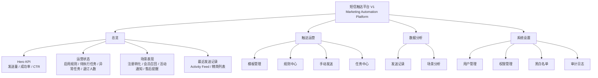

# 短信触达平台 V1 - UI/UX 重构计划

## 1. 文档目的

本文基于《短信触达平台 V1 - UI/UX 重构规范》输出，用于指导当前前端 UI 从传统 Admin Dashboard 风格升级为 Marketing Automation Platform 风格。

本计划只涉及 UI/UX 重构，不修改业务逻辑、不修改 API、不修改数据库结构、不新增业务功能。

允许改动范围：

1. 布局优化。
2. 组件优化。
3. 视觉优化。
4. 交互优化。
5. 信息层级优化。

禁止改动范围：

1. 禁止修改业务逻辑。
2. 禁止修改 API。
3. 禁止修改数据库结构。
4. 禁止新增业务功能。
5. 禁止把系统继续做成传统后台管理系统风格。

最终目标：

> 用户首次打开页面后的第一感受应为“这是一个营销自动化平台”，而不是“这是一个后台管理系统”。

## 2. 项目背景

当前系统已具备完整的基础功能：

1. 运营总览。
2. 模板管理。
3. 规则中心。
4. 手动发送。
5. 事件触发。
6. 任务队列。
7. 发送记录。
8. 用户管理。
9. 权限管理。
10. 黑白名单。
11. 审计能力。

功能层面已经具备短信触达平台 V1 的核心能力，但当前视觉呈现仍偏传统 Admin Dashboard。

当前主要问题：

1. 信息密度过高。
2. 缺少运营产品特征。
3. KPI 不突出。
4. 表格占比过高。
5. 缺少数据驱动感。
6. 缺少商业化产品气质。
7. 首页内容平铺，视觉层级不足。
8. 菜单数量过多，认知负担偏高。

改造目标：

> 将产品升级为 Marketing Automation Platform，而不是 Admin Management System。

## 3. 设计参考

### 3.1 推荐参考

设计方向参考以下产品气质：

1. Braze。
2. Customer.io。
3. Iterable。
4. HubSpot Marketing。
5. Salesforce Marketing Cloud。

参考重点：

1. 数据驱动的运营首页。
2. 清晰突出的核心 KPI。
3. 自动化规则的卡片化和流程感。
4. 场景表现和增长指标的可视化。
5. 轻量、现代、商业 SaaS 的视觉语言。

### 3.2 避免参考

避免继续参考以下类型：

1. Ant Design Pro。
2. 通用 CRM 后台。
3. 传统运维系统。
4. ERP 管理后台。
5. 重表格、重边框、重管理的 Admin Dashboard。

## 4. 整体设计语言

### 4.1 风格定位

新 UI 风格：

1. Modern SaaS Dashboard。
2. 运营增长平台。
3. 营销自动化平台。

### 4.2 产品气质

需要体现：

1. 专业。
2. 数据驱动。
3. 商业化。
4. 增长运营。
5. 轻量。
6. 高级感。

关键词：

1. Clean。
2. Data Driven。
3. Minimal。
4. Marketing。
5. Growth。
6. Automation。

### 4.3 视觉约束

必须避免：

1. 页面被表格完全占据。
2. 所有指标权重一致。
3. 大面积高饱和背景。
4. 超过 5 种主色。
5. 复杂 BI 风格图表。
6. 3D 图表。
7. 重边框卡片。
8. 传统后台感过强的密集筛选和列表平铺。

## 5. 第一步：新的页面结构图

### 5.1 全局信息架构



### 5.2 一级导航

新一级菜单：

| 一级菜单 | 定位 | 说明 |
| --- | --- | --- |
| 总览 | 增长运营首页 | 展示核心 KPI、运营状态、场景表现、最近发送 |
| 触达运营 | 触达配置与执行 | 管理模板、规则、手动发送和任务 |
| 数据分析 | 触达数据复盘 | 查看发送记录和场景分析 |
| 系统设置 | 管理和治理能力 | 管理用户、权限、黑白名单和审计 |

### 5.3 二级菜单

| 一级菜单 | 二级菜单 |
| --- | --- |
| 触达运营 | 模板管理、规则中心、手动发送、任务中心 |
| 数据分析 | 发送记录、场景分析 |
| 系统设置 | 用户管理、权限管理、黑白名单、审计日志 |

菜单优化目标：

1. 降低认知负担。
2. 避免菜单像传统后台一样过度展开。
3. 把用户注意力集中到运营增长、触达自动化和数据表现上。

### 5.4 总览页新结构

```text
总览 Overview

[第一层 Hero KPI]
发送量       成功率       CTR
大数字       大数字       大数字
趋势提示     趋势提示     趋势提示

[第二层 运营状态]
启用规则数   待执行任务   异常任务   退订人数

[第三层 场景表现]
注册转化     会员召回     活动通知     售后提醒
发送量       点击率       小趋势图

[第四层 最近发送记录]
Activity Feed / 精简任务列表
控制高度，不做超长表格
```

### 5.5 触达运营页面结构

```text
触达运营

模板管理
- 模板卡片列表
- 场景标签
- 启用状态
- 轻量操作

规则中心
- 规则表现概览
- 自动化规则卡片
- 状态、触发事件、发送表现
- 重点优化，不做纯表格页

手动发送
- 模板选择
- 接收人输入
- 发送预览
- 确认发送

任务中心
- 待执行 / 异常 / 已完成分组
- Timeline 或任务卡片
- 必要时保留紧凑表格
```

### 5.6 数据分析页面结构

```text
数据分析

发送记录
- 保留表格
- 优化状态、可读性、筛选和行高

场景分析
- 趋势图
- 环形图
- 横向条形图
- 场景卡片
```

### 5.7 系统设置页面结构

```text
系统设置

用户管理
权限管理
黑白名单
审计日志

保持管理型页面，但统一视觉，不做传统重边框后台风格
```

## 6. 第二步：组件映射方案

### 6.1 模块到组件映射

| 当前模块 | 新页面定位 | 推荐组件 | 改造方向 |
| --- | --- | --- | --- |
| 运营总览 | Marketing Overview | `HeroKPISection`、`MetricCard`、`ScenarioPerformanceCard`、`ActivityFeed` | 从平铺后台首页改为增长运营首页 |
| KPI 卡片 | Hero KPI | `HeroMetric` | 发送量、成功率、CTR 放大展示 |
| 规则列表 | Automation Rules | `AutomationRuleCard`、`RuleStatusPill`、`MiniTrend` | 减少表格感，突出自动化规则表现 |
| 模板管理 | Template Center | `TemplateCard`、`ChannelBadge`、`StatusPill` | 轻度优化，卡片化展示 |
| 手动发送 | Campaign Send Panel | `SendPreviewCard`、`RecipientInput`、`ConfirmPanel` | 强化发送预览和操作确认 |
| 任务队列 | Task Center | `TaskStatusTabs`、`TaskCard`、`Timeline` | 从任务表格改为状态分组 |
| 发送记录 | Send Logs | `DataTable`、`StatusBadge`、`CompactFilterBar` | 保留表格，但提升可读性 |
| 场景分布 | Scenario Analytics | `ScenarioCard`、`DonutChart`、`BarChart`、`TrendLine` | 增强数据驱动感 |
| 黑白名单 | Safety Lists | `ListCard`、`StatusPill`、`CompactTable` | 保留管理能力，降低厚重后台感 |
| 审计日志 | Audit Feed | `AuditTimeline`、`ActivityItem` | 从日志表格改为时间线优先 |
| 导航 | SaaS Navigation | `SidebarNav`、`NavGroup` | 一级菜单收敛为 4 个 |
| 状态展示 | Unified Status | `Badge`、`Tag`、`Pill` | 成功绿、失败红、待执行橙、停用灰 |

### 6.2 核心新增或重构组件

| 组件 | 用途 | 视觉要求 | 优先级 |
| --- | --- | --- | --- |
| `HeroKPISection` | 首页首屏核心指标 | 大数字、大留白、高权重 | P0 |
| `HeroMetric` | 发送量、成功率、CTR | 高度不低于次级指标 1.5 倍 | P0 |
| `SecondaryMetricCard` | 失败量、退订量、待发送 | 低视觉权重，辅助决策 | P0 |
| `ScenarioPerformanceCard` | 场景表现 | 卡片 + 小趋势图 | P0 |
| `AutomationRuleCard` | 规则中心规则展示 | 卡片化，减少表格 | P0 |
| `ActivityFeed` | 最近发送、审计动态 | 时间线或动态流 | P0 |
| `StatusPill` | 状态展示 | 统一 Badge/Tag/Pill 样式 | P0 |
| `MiniTrend` | 小趋势图 | 轻量，不做复杂 BI | P1 |
| `CompactDataTable` | 必要表格 | 用于发送记录等强表格场景 | P1 |
| `TaskStatusTabs` | 任务状态分组 | 待执行、异常、已完成 | P1 |
| `SendPreviewCard` | 手动发送预览 | 强调最终短信内容 | P1 |
| `AuditTimeline` | 审计日志 | 按时间线展示操作行为 | P1 |

### 6.3 组件替换规则

| 旧呈现方式 | 新呈现方式 |
| --- | --- |
| 首页普通 KPI 卡片 | `HeroKPISection` + `HeroMetric` |
| 首页规则列表 | 运营状态 + 场景表现 |
| 规则中心纯表格 | `AutomationRuleCard` 卡片流 |
| 最近发送长表格 | `ActivityFeed` 或精简列表 |
| 场景分布普通文字/列表 | `ScenarioPerformanceCard` + 图表 |
| 审计日志普通表格 | `AuditTimeline` |
| 状态纯文字 | `StatusPill` |

## 7. 第三步：重构计划

### 7.1 阶段 1：信息架构重构

目标：

> 先把产品从 Admin Dashboard 的结构改成 Marketing Automation Platform 的结构。

改造范围：

1. 一级导航调整为总览、触达运营、数据分析、系统设置。
2. 二级菜单按触达运营、数据分析、系统设置重新归类。
3. 首页重构为四层结构：Hero KPI、运营状态、场景表现、最近发送记录。
4. 减少首页表格占比。
5. 强化增长运营和营销自动化视角。

不允许：

1. 不修改 API。
2. 不新增业务字段。
3. 不新增业务功能。

### 7.2 阶段 2：视觉系统重构

目标：

> 建立统一的现代 SaaS Dashboard 视觉语言。

卡片规范：

| 项目 | 规范 |
| --- | --- |
| 圆角 | 16px |
| 内边距 | 24px |
| 卡片间距 | 24px |
| 阴影 | 极弱阴影 |
| 边框 | 禁止重边框 |

留白规范：

| 间距 | 用途 |
| --- | --- |
| 8px | 小元素间距 |
| 16px | 表单项、局部模块间距 |
| 24px | 卡片内边距、卡片间距 |
| 32px | 页面区块间距 |
| 48px | 大区块和首屏留白 |

字体规范：

| 层级 | 字号 |
| --- | --- |
| H1 | 32px |
| H2 | 24px |
| Body | 14px |
| Caption | 12px |

配色规范：

| 类型 | 颜色方向 |
| --- | --- |
| 主色 | 蓝色系 |
| 辅助 | 绿色 |
| 告警 | 橙色 |
| 错误 | 红色 |
| 停用 | 灰色 |

限制：

1. 禁止超过 5 种主色。
2. 禁止大面积高饱和背景。
3. 禁止复杂 BI 风格。
4. 禁止 3D 图表。

### 7.3 阶段 3：核心页面改造

核心页面优先级：

| 优先级 | 页面 | 改造目标 |
| --- | --- | --- |
| P0 | 运营总览 | 必须重构，形成营销自动化平台首屏 |
| P0 | 规则中心 | 重点优化，突出自动化规则和触达表现 |
| P0 | 统计页面 / 场景分析 | 增强数据驱动感 |
| P1 | 发送记录 | 保留表格，但优化可读性 |
| P1 | 模板中心 | 轻度优化，卡片化和状态更清晰 |
| P1 | 任务中心 | 状态分组，减少传统任务表格感 |
| P2 | 系统设置 | 保持管理属性，但统一视觉风格 |

### 7.4 阶段 4：减少表格占比

规则：

1. 发送记录保留表格。
2. 规则中心从表格优先改为卡片优先。
3. 场景表现使用图表和卡片。
4. 最近发送使用 Activity Feed。
5. 审计日志优先 Timeline。
6. 系统设置保留管理型结构，但弱化传统后台样式。

优先使用：

1. Card。
2. Stat。
3. Chart。
4. Timeline。
5. Activity Feed。

谨慎使用：

1. 长表格。
2. 密集筛选表单。
3. 重边框列表。
4. 传统后台详情页。

### 7.5 阶段 5：验收与收口

完成后首页必须满足：

1. 第一眼看到发送量、成功率、CTR。
2. 发送量、成功率、CTR 的视觉权重大于其他指标。
3. 第一优先级指标高度不低于第二优先级指标 1.5 倍。
4. 首页不再是表格平铺。
5. 页面气质接近 Braze、Customer.io、Iterable，而不是 Ant Design Pro。
6. 场景表现有图表。
7. 规则中心呈现自动化平台感。
8. 用户第一感受是“营销自动化平台”，不是“后台管理系统”。

## 8. 页面级改造要求

### 8.1 运营总览

改造等级：P0，必须重构。

当前问题：

1. KPI、规则列表、场景分布、发送记录全部平铺。
2. 缺少视觉层级。
3. KPI 权重不足。
4. 表格感过强。

新结构：

```text
运营总览

第一层：Hero KPI
- 发送量
- 成功率
- CTR

第二层：运营状态
- 启用规则数
- 待执行任务
- 异常任务
- 退订人数

第三层：场景表现
- 注册转化
- 会员召回
- 活动通知
- 售后提醒

第四层：最近发送记录
- 最近任务
- 控制高度
- 避免超长表格
```

视觉要求：

1. Hero KPI 占据首页首屏主要视觉区域。
2. 发送量、成功率、CTR 使用大数字。
3. 三个核心指标需要大留白和高视觉权重。
4. 第二优先级指标弱化展示。
5. 最近发送记录控制高度，不允许铺满页面。

### 8.2 规则中心

改造等级：P0，重点优化。

当前问题：

1. 容易呈现为普通后台表格。
2. 自动化规则的业务价值不突出。
3. 缺少营销自动化平台的流程感。

新结构：

```text
规则中心

顶部概览
- 启用规则数
- 今日触发
- 生成任务
- 异常规则

规则卡片区
- 规则名称
- 业务场景
- 触发事件
- 模板
- 状态
- 发送量
- 点击率
- 小趋势

必要操作
- 查看
- 编辑
- 启停
- 测试
```

视觉要求：

1. 优先使用 `AutomationRuleCard`。
2. 减少纯表格使用。
3. 每条规则像一个自动化触达单元，而不是一条数据库记录。
4. 状态使用 Pill。
5. 规则表现尽量用数字和小趋势呈现。

### 8.3 模板中心

改造等级：P1，轻度优化。

新结构：

```text
模板中心

模板卡片
- 模板名称
- 业务场景
- 状态
- 变量数量
- 最近使用
- 轻量操作
```

视觉要求：

1. 可从表格改为卡片，或表格与卡片混合。
2. 重点突出场景、状态、最近使用。
3. 不做复杂重构。

### 8.4 手动发送

改造等级：P1。

新结构：

```text
手动发送

模板选择
接收人输入
变量填写
短信预览
发送确认
```

视觉要求：

1. 强化发送预览。
2. 让用户在发送前明确看到最终短信内容。
3. 保持轻量，不新增发送逻辑。

### 8.5 任务中心

改造等级：P1。

新结构：

```text
任务中心

状态分组
- 待执行
- 异常
- 已完成

任务卡片 / 紧凑列表
- 任务状态
- 场景
- 计划时间
- 失败或拦截原因
```

视觉要求：

1. 减少任务表格感。
2. 异常任务要更突出。
3. 保留必要列表可读性。

### 8.6 发送记录

改造等级：P1。

要求：

1. 发送记录保留表格。
2. 优化状态、可读性、筛选和行高。
3. 状态使用统一 Badge、Tag、Pill。
4. 避免表格过密。
5. 最近发送在首页只展示精简版本。

### 8.7 场景分析

改造等级：P0。

新结构：

```text
场景分析

趋势图
环形图
横向条形图
场景表现卡片
```

图表要求：

1. 增加趋势图。
2. 增加环形图。
3. 增加横向条形图。
4. 禁止复杂 BI 风格。
5. 禁止 3D 图表。
6. 禁止高饱和颜色。

### 8.8 系统设置

改造等级：P2。

要求：

1. 保持设置页属性。
2. 弱化传统后台感。
3. 使用分组卡片。
4. 黑白名单和审计日志可继续保持列表，但视觉上统一圆角、间距和状态样式。

## 9. KPI 设计规范

### 9.1 指标优先级

第一优先级：

1. 发送量。
2. 成功率。
3. CTR。

第二优先级：

1. 失败量。
2. 退订量。
3. 待发送。
4. 启用规则数。
5. 异常任务。

### 9.2 视觉规则

1. 第一优先级指标高度必须大于等于第二优先级指标的 1.5 倍。
2. 第一优先级指标使用大数字。
3. 第一优先级指标需要更大留白。
4. 第二优先级指标只作为辅助运营状态展示。
5. 所有指标不得权重相同。

## 10. 卡片规范

统一规范：

| 项目 | 值 |
| --- | --- |
| 圆角 | 16px |
| 内边距 | 24px |
| 卡片间距 | 24px |
| 阴影 | 极弱阴影 |
| 边框 | 禁止重边框 |

使用场景：

1. KPI。
2. 运营状态。
3. 场景表现。
4. 规则卡片。
5. 模板卡片。
6. 设置分组。

## 11. 表格规范

整体原则：

> 减少表格使用，但不是完全取消表格。

优先使用：

1. Card。
2. Stat。
3. Chart。
4. Timeline。
5. Activity Feed。

保留表格的场景：

1. 发送记录。
2. 用户管理。
3. 黑白名单。
4. 必要的审计日志明细。

表格视觉要求：

1. 行高适当增加。
2. 状态用 Badge、Tag、Pill。
3. 操作列不要过多按钮平铺。
4. 避免重边框。
5. 控制表格在首页中的高度。

## 12. 图表规范

需要增加：

1. 趋势图。
2. 环形图。
3. 横向条形图。

使用场景：

| 图表 | 场景 |
| --- | --- |
| 趋势图 | 发送量、成功率、CTR 趋势 |
| 环形图 | 场景占比、状态占比 |
| 横向条形图 | 场景表现排名、规则表现排名 |

禁止：

1. 复杂 BI 风格。
2. 3D 图表。
3. 高饱和颜色。
4. 过多图例和网格线。

## 13. 状态设计

统一状态颜色：

| 状态 | 颜色方向 |
| --- | --- |
| 成功 | 绿色 |
| 失败 | 红色 |
| 待执行 | 橙色 |
| 停用 | 灰色 |

统一组件：

1. Badge。
2. Tag。
3. Pill。

要求：

1. 状态必须有文字，不只依赖颜色。
2. 同一种状态在全系统保持一致。
3. 状态样式轻量，不使用大面积色块。

## 14. 开发执行限制

本次 UI/UX 重构严格限制在前端表现层。

允许：

1. 调整页面布局。
2. 调整导航结构。
3. 调整组件组合。
4. 调整样式、颜色、间距、圆角、阴影。
5. 调整图表展示方式。
6. 调整信息层级。
7. 调整表格为卡片、图表、动态流。

禁止：

1. 禁止修改业务逻辑。
2. 禁止修改 API。
3. 禁止修改数据库结构。
4. 禁止新增业务功能。
5. 禁止新增后端接口。
6. 禁止改变原有权限规则。
7. 禁止改变短信发送、任务执行、规则匹配逻辑。

## 15. 验收标准

### 15.1 首屏验收

用户首次打开总览页后，必须满足：

1. 第一眼看到发送量、成功率、CTR。
2. 三个核心指标使用大数字。
3. 三个核心指标有明显视觉权重。
4. 首页不是传统表格平铺。
5. 首页具备 Marketing Automation Platform 的感受。

### 15.2 页面验收

1. 导航一级菜单收敛为总览、触达运营、数据分析、系统设置。
2. 总览页包含 Hero KPI、运营状态、场景表现、最近发送记录四层。
3. 规则中心不再以纯表格作为主要呈现。
4. 场景表现必须包含图表。
5. 发送记录保留表格，但可读性提升。
6. 系统设置保持管理属性，但视觉上不应像传统运维后台。

### 15.3 视觉验收

1. 卡片圆角统一为 16px。
2. 卡片内边距统一为 24px。
3. 卡片间距统一为 24px。
4. 使用极弱阴影。
5. 禁止重边框。
6. 采用 8px Grid System。
7. 主色为蓝色系。
8. 状态颜色统一。
9. 页面不超过 5 种主色。
10. 无大面积高饱和背景。

### 15.4 产品气质验收

完成后应接近：

1. Braze。
2. Customer.io。
3. Iterable。
4. HubSpot Marketing。
5. Salesforce Marketing Cloud。

不应接近：

1. Ant Design Pro。
2. 通用 CRM 后台。
3. 传统运维系统。
4. ERP 管理后台。

## 16. 最小可落地版本

如果时间有限，最小重构范围只做以下 8 件事：

1. 一级导航收敛为总览、触达运营、数据分析、系统设置。
2. 总览页首屏改为 Hero KPI，突出发送量、成功率、CTR。
3. 第二层增加运营状态：启用规则、待执行任务、异常任务、退订人数。
4. 第三层增加场景表现卡片和图表。
5. 最近发送记录改为精简列表或 Activity Feed，控制高度。
6. 规则中心改为卡片优先，减少纯表格感。
7. 状态统一为 Badge、Tag、Pill。
8. 卡片统一 16px 圆角、24px 内边距、24px 间距、极弱阴影。

完成这 8 件事后，产品第一感受会明显从传统后台转为营销自动化平台。

## 17. 实施顺序

### 17.1 第一阶段：结构先行

输出：

1. 新一级导航。
2. 新二级菜单。
3. 总览页四层结构。
4. 首页 Hero KPI。

### 17.2 第二阶段：视觉统一

输出：

1. 卡片规范。
2. 状态 Pill。
3. 字体层级。
4. 间距体系。
5. 主色和辅助色。

### 17.3 第三阶段：核心页面重构

输出：

1. 运营总览重构。
2. 规则中心重点优化。
3. 场景分析增强数据感。
4. 发送记录优化可读性。
5. 模板中心轻度优化。

### 17.4 第四阶段：验收收口

输出：

1. 对照首屏验收。
2. 对照页面验收。
3. 对照视觉验收。
4. 对照产品气质验收。

## 18. 最终目标复述

本次重构不是为了做一个更漂亮的 Admin Dashboard，而是要把短信触达平台包装为营销自动化产品。

最终判断标准：

> 用户第一次打开页面后，应认为这是一个面向增长运营的 Marketing Automation Platform，而不是一个普通后台管理系统。
