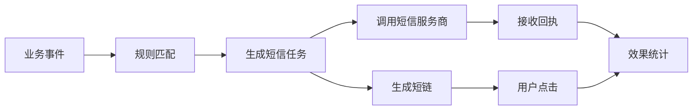

# 项目摘要

## 项目目标

短信触达平台 V1 面向运营人员，目标是支持运营自主配置短信触达策略，减少研发介入，并在关键业务节点自动触达用户。

完整链路为：



## V1 核心能力

- 短信模板管理
- 手动发送
- 自动规则触发
- 短链追踪
- 回执状态管理
- 效果统计分析

## 业务场景

| 场景 | 目标 | 触发事件 | 典型条件 | 动作 | 核心指标 |
| --- | --- | --- | --- | --- | --- |
| 注册转化 | 提升注册用户付费转化率 | `user_register` | 注册后 24 小时未付费 | 发送注册转化短信 | 发送量、点击率、注册转化率 |
| 会员召回 | 提升会员续费率 | `membership_expired` | 会员过期后 N 天 | 发送续费提醒短信 | 发送量、点击率、续费率 |
| 活动通知 | 提升活动参与度 | `campaign_start` | 活动开始前 N 分钟/小时 | 发送活动通知短信 | 发送量、点击率 |
| 售后回访 | 提升售后服务闭环率 | `order_completed` | 订单完成后 N 天 | 发送回访短信 | 发送量、点击率、回访完成率 |

## 事件定义

标准事件结构：

```json
{
  "eventId": "uuid",
  "eventType": "user_register",
  "occurredAt": "2026-06-03T10:00:00Z",
  "userId": "123",
  "payload": {}
}
```

V1 支持事件：

| 事件编码 | 触发时机 | 来源系统 | 业务用途 |
| --- | --- | --- | --- |
| `user_register` | 用户完成注册 | 用户中心 | 注册转化提醒 |
| `membership_expired` | 会员状态变为已过期 | 会员中心 | 会员召回 |
| `campaign_start` | 活动进入开始状态 | 活动中心 | 活动通知 |
| `order_completed` | 订单状态变为完成 | 订单中心 | 售后回访 |

## 规则模型

规则中心面向运营配置自动触达规则，核心模型为：

```text
WHEN 事件发生
AND 满足条件
THEN 发送短信
```

V1 规则模型为单事件、单条件、单动作，不支持复杂表达式。

规则基础字段包括规则名称、规则编码、规则描述、状态、触发事件、条件配置和动作配置。动作配置 V1 仅支持选择短信模板并发送。

## 系统模块

| 模块 | 职责 |
| --- | --- |
| 管理后台 | 模板管理、规则管理、手动发送、发送记录、效果统计 |
| 事件接收模块 | 接收业务系统事件，校验幂等并保存事件 |
| 规则执行模块 | 根据事件匹配启用规则，生成待发送任务 |
| 短信发送模块 | 封装短信服务商 API，测试版默认 mock，真实验证时通过阿里云 SDK 调用号码认证服务 `SendSmsVerifyCode` |
| 短链模块 | 生成短链、跳转目标地址、记录点击 |
| 回执模块 | 接收短信服务商 webhook，更新发送状态 |
| 统计模块 | 按规则、模板、日期聚合发送、成功、失败、点击、CTR 等数据 |

## 核心流程

### 手动发送

运营选择短信模板 -> 输入手机号或导入 CSV -> 系统生成发送任务 -> 调用短信服务商 -> 记录发送状态 -> 接收回执 -> 更新发送记录。

### 自动触发

业务系统上报事件 -> 平台保存事件 -> 查询启用规则 -> 校验条件 -> 生成计划发送任务 -> 定时扫描发送 -> 接收回执并更新状态。

### 短链点击

用户点击短链 -> 查询短链配置 -> 写入点击日志 -> 302 跳转到目标地址 -> 统计点击数据。

## 数据表

| 表名 | 用途 |
| --- | --- |
| `sms_template` | 短信模板，包含场景、服务商模板 ID、模板内容、变量和状态 |
| `sms_rule` | 自动触达规则，包含事件类型、延迟配置、条件类型、模板和状态 |
| `sms_event` | 业务事件，要求 `event_id` 唯一以避免重复消费 |
| `sms_task` | 发送任务，区分手动和自动任务，记录计划发送、实际发送、状态和失败原因 |
| `sms_send_log` | 短信发送请求和服务商响应日志 |
| `sms_receipt` | 服务商回执记录 |
| `sms_short_link` | 短链配置 |
| `sms_click_log` | 短链点击日志 |

## API 概览

| 接口 | 用途 |
| --- | --- |
| `POST /api/sms/templates` | 创建短信模板 |
| `GET /api/sms/templates` | 查询模板列表，支持按场景、状态、关键词筛选 |
| `PATCH /api/sms/templates/{id}/status` | 启停模板 |
| `POST /api/sms/rules` | 创建规则 |
| `GET /api/sms/rules` | 查询规则列表 |
| `PATCH /api/sms/rules/{id}/status` | 启停规则 |
| `POST /api/sms/events` | 接收业务事件，保存事件并匹配规则 |
| `POST /api/sms/manual-send` | 手动发送短信 |
| `POST /api/sms/provider/callback` | 接收短信服务商回执 |
| `GET /s/{shortCode}` | 短链跳转并记录点击 |
| `GET /api/sms/stats/overview` | 查询统计概览 |

## 状态和统计

任务状态：`pending`、`sending`、`success`、`failed`。

统计口径：

| 指标 | 口径 |
| --- | --- |
| 发送量 | `sms_task` 中 `sent_at` 不为空的任务数 |
| 成功量 | `status = success` 或回执状态为 `delivered` |
| 失败量 | `status = failed` |
| 点击量 | `sms_click_log` 总数 |
| 点击人数 | 按 `user_id` 去重 |
| CTR | 点击人数 / 成功送达人数 |

## 幂等、合规和失败处理

- 事件幂等：`sms_event.event_id` 加唯一索引，重复事件直接忽略。
- 发送幂等：发送前将任务从 `pending` 原子更新为 `sending`，只有更新成功的任务才能发送。
- 回执幂等：建议用 `provider_msg_id + receipt_status` 做唯一约束，避免重复写入。
- 手机号展示需要脱敏，例如 `138****0000`。
- 后台操作需要记录创建模板、修改规则、手动发送、启停规则等操作人。
- 单次批量发送建议最多 500 条。
- 发送失败需记录失败原因并支持人工重发；回执长时间未返回时状态保持 `unknown`。

## V1 不做内容

- 多级审批
- 多服务商路由
- 用户分群
- AB 实验
- 营销旅程
- 转化归因
- 复杂规则表达式

## 开发排期建议

| 时间 | 内容 |
| --- | --- |
| Day 1 | 数据库表、模板管理、短信服务商封装、手动发送、发送记录 |
| Day 2 | 事件接收、规则管理、规则匹配、任务生成、定时发送 |
| Day 3 | 短链生成、点击记录、回执接收、状态更新、基础统计 |
| Day 4 | 页面联调、异常处理、权限控制、日志补齐、验收测试 |

## 验收标准

- 模板可创建、启停。
- 手动短信可发送。
- 四类事件可接收。
- 规则可创建、启停。
- 事件触发后可生成短信任务。
- 短信任务可按计划发送。
- 短信服务商回执可更新状态。
- 短链点击可记录。
- 统计页可展示发送量、成功量、失败量、点击量、CTR。
