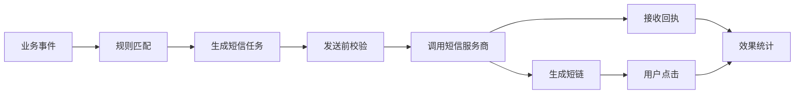
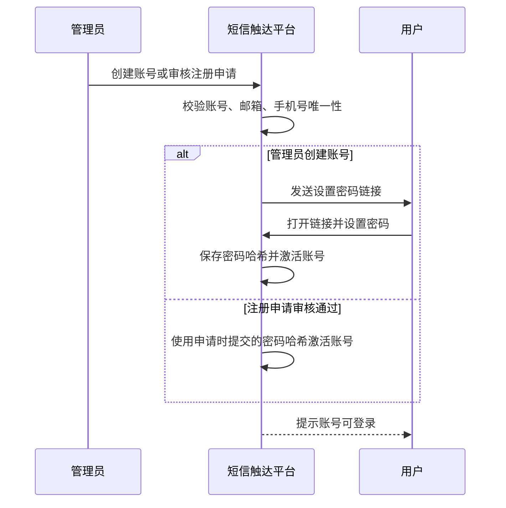
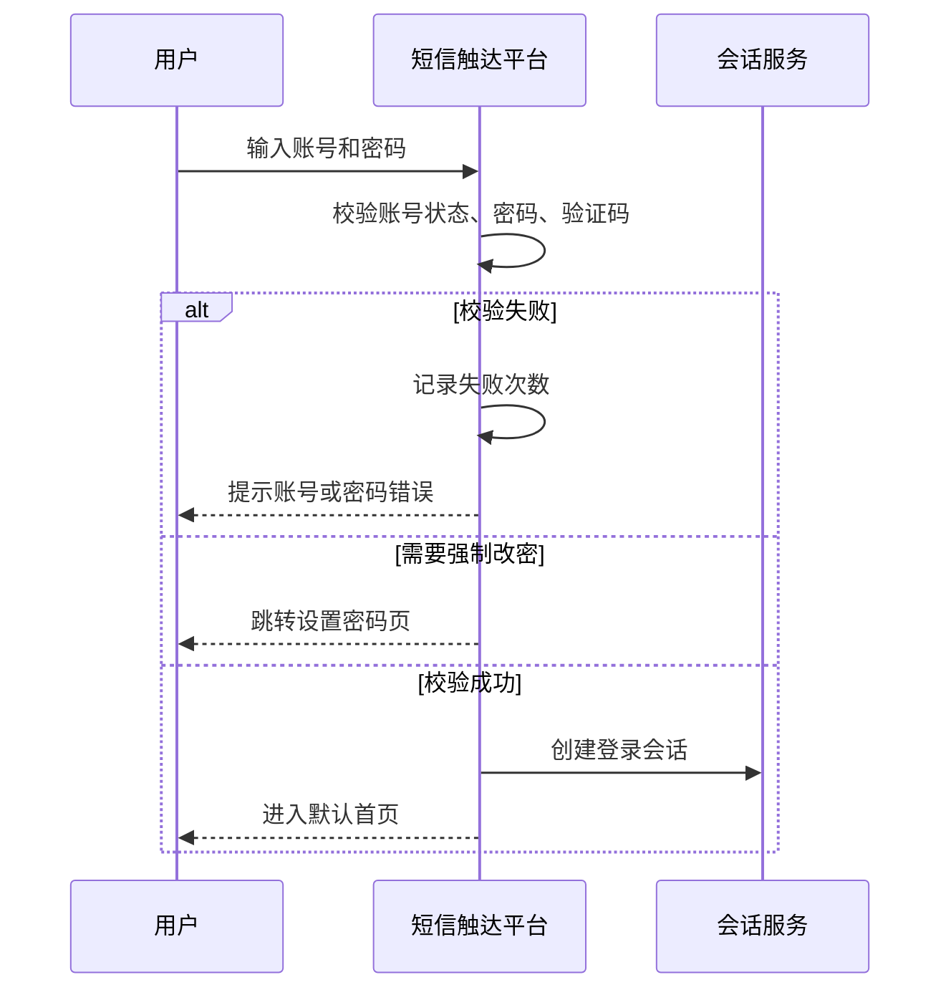
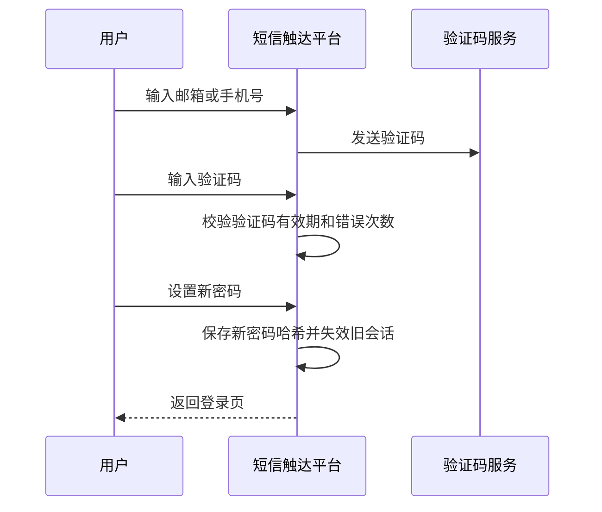
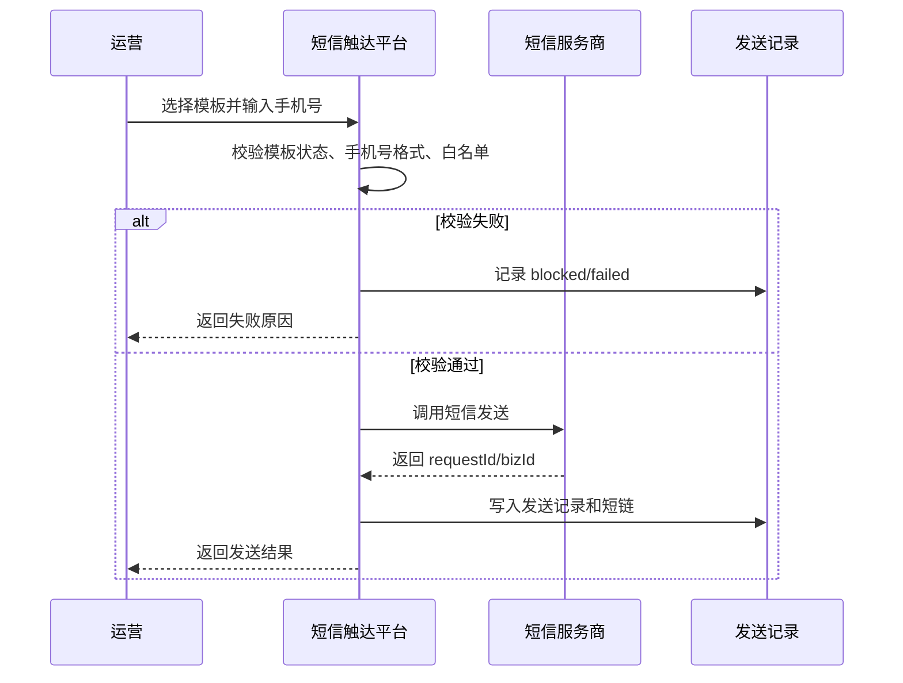
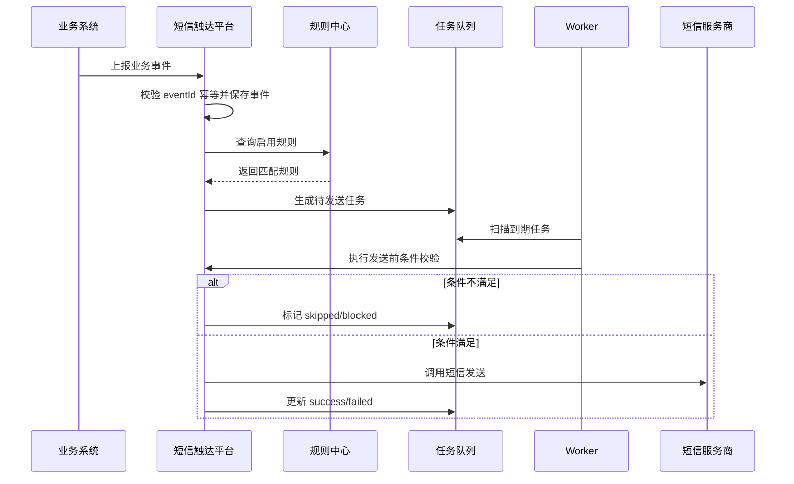
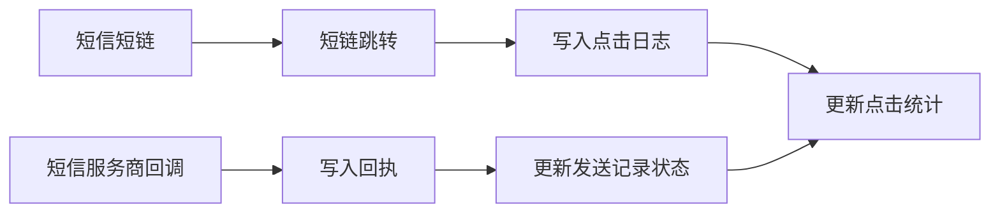
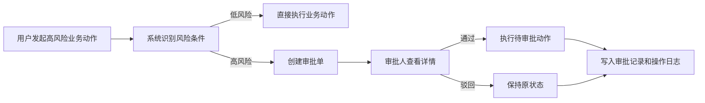

# 短信触达平台 V1.0 产品需求文档

## 一、文档基础信息与版本控制

### 1.1 文档基础信息

| 项目 | 内容 |
| --- | --- |
| 系统名称 | 短信触达平台 |
| 系统定位 | 面向运营人员的短信自动化触达工作台，支持模板、规则、事件、任务、发送记录和效果统计的完整闭环 |
| 适用读者 | 运营、增长、产品、研发、测试、运维 |
| 当前版本 | V1.0 |
| 文档日期 | 2026-06-08 |
| 关联资料 | `doc/短信触达平台 V1 PRD.pdf`、`doc/短信触达平台 V1 - 规则中心设计.pdf`、`doc/短信触达平台 V1 - 事件定义文档.pdf`、`doc/短信触达平台 V1 技术设计文档.pdf` |

### 1.2 版本控制

| 变更日期 | 版本号 | 变更内容 |
| --- | --- | --- |
| 2026-06-08 | V1.0 | 结合后台系统需求文档结构，整理短信触达平台产品需求、页面功能、业务规则、权限、安全边界与验收标准 |

## 二、项目背景与业务价值

### 2.1 业务背景

当前业务增长场景中，用户注册、会员过期、活动开始、订单完成等关键节点均存在短信触达诉求。若每次触达都依赖研发临时写脚本或手动调用服务商接口，会带来以下问题：

1. 运营配置效率低，规则调整、文案切换、发送时间变更都需要研发介入。
2. 触达链路不透明，任务是否生成、短信是否发送、用户是否点击缺少统一查询入口。
3. 真实发送存在误发风险，需要白名单、频控、黑名单、权限和审计约束。
4. 效果复盘割裂，发送、回执、点击、转化数据无法沉淀为可复用指标。

### 2.2 产品目标

短信触达平台 V1.0 的目标是搭建一套可运营、可追踪、可防误发的短信触达后台，先跑通从业务事件到发送统计的主链路：



### 2.3 预期收益

| 目标 | 说明 |
| --- | --- |
| 提升运营效率 | 运营可自主创建模板、配置规则、查看任务和发送结果 |
| 降低研发成本 | 常规触达需求通过规则配置完成，减少一次性脚本和临时接口调用 |
| 降低误发风险 | 默认 mock、真实发送白名单、worker 显式开关、手机号脱敏 |
| 沉淀增长数据 | 统一记录发送量、成功量、失败量、拦截量、点击量和 CTR |

## 三、业务范围与功能清单

### 3.1 V1.0 功能范围

| 一级模块 | 二级功能 | 说明 |
| --- | --- | --- |
| 登录与账号 | 账号注册 | 支持管理员创建账号、用户提交注册申请两种模式 |
| 登录与账号 | 设置密码 | 管理员创建的新账号首次登录前必须设置登录密码；注册申请用户在提交申请时必须设置密码 |
| 登录与账号 | 账号密码登录 | 支持账号/邮箱/手机号 + 密码登录后台 |
| 登录与账号 | 记住账号 | 支持本机记住账号，不保存明文密码 |
| 登录与账号 | 忘记密码 | 支持通过邮箱或手机号验证码验证身份后重置密码 |
| 登录与账号 | 重置密码 | 支持用户自助重置、管理员重置、密码过期强制重置 |
| 登录与账号 | 退出登录 | 用户主动退出后清除本地登录态并返回登录页 |
| 登录与账号 | 会话安全 | 支持登录态过期、账号锁定、异地登录提示和验证码风控 |
| 用户与角色 | 用户管理 | 支持用户列表、新建、编辑、启用、禁用、解锁、重置密码、注册申请审核，并内联查看角色详情 |
| 用户与角色 | 角色说明 | 不作为独立菜单；在用户管理中查看内置角色详情和权限说明；V1.0 不支持自定义权限树配置 |
| 运营总览 | 指标概览 | 展示发送量、成功量、失败量、待发送、点击量、CTR、拦截量 |
| 运营总览 | 最近发送 | 展示最近短信发送记录 |
| 运营总览 | 待处理任务 | 展示近期待发送或到期任务 |
| 短信模板 | 模板库 | 查询模板、查看业务场景、服务商模板 Code、变量和状态 |
| 短信模板 | 新建模板 | 创建短信模板，维护模板名称、场景、服务商模板 Code、模板内容和变量 |
| 短信模板 | 模板详情/编辑 | 支持查看模板详情、编辑模板、变量预览、测试发送 |
| 短信模板 | 启停模板 | 启用或停用模板，停用模板不可被新规则使用 |
| 规则中心 | 自动触达规则 | 查询规则、查看触发事件、条件、模板、状态 |
| 规则中心 | 新建规则 | 配置单事件、单条件、单动作规则 |
| 规则中心 | 规则详情/编辑 | 支持查看规则详情、编辑规则、复制规则、规则测试、影响范围预估 |
| 规则中心 | 草稿与发布 | 支持规则草稿、发布、回滚和高风险启用审批 |
| 规则中心 | 启停规则 | 控制规则是否参与事件匹配 |
| 测试/补发 | 单手机号测试发送 | 运营选择模板并输入手机号，用于测试链路、客户补发和内部联调 |
| 事件触发 | 模拟业务事件 | 在后台模拟触发业务事件，用于联调和测试 |
| 事件触发 | 事件流水 | 查看已接收事件的类型、eventId、手机号 |
| 任务队列 | 任务列表 | 查看计划发送时间、触发方式、场景、模板、状态、尝试次数 |
| 任务队列 | 执行到期任务 | 手动扫描并执行到期任务 |
| 发送记录 | 发送日志 | 查看手动/自动触发、手机号、模板、状态、回执、短链和服务商返回 |
| 发送记录 | 标记送达 | 测试环境下可模拟服务商回执，将指定日志标记为送达 |
| 统计分析 | 趋势分析 | 支持按日期查看发送、成功、失败、跳过、点击趋势 |
| 统计分析 | 维度分析 | 支持按规则、模板、场景、Provider 聚合分析 |
| 统计分析 | 漏斗分析 | 支持任务、发送、送达、点击的基础漏斗 |
| 数据导出 | 列表导出 | 支持任务、发送记录、黑名单、退订、操作日志等导出 |
| 批量操作 | 任务批处理 | 支持批量取消、批量重试失败任务 |
| 操作日志 | 操作日志 | 支持查询关键操作、查看详情、变更前后差异和导出 |
| 审批记录 | 审批列表 | 支持查看高风险操作审批单、审批详情和处理记录 |
| 黑名单与退订 | 黑名单管理 | 支持黑名单列表、添加、移除、导入、来源和原因管理 |
| 黑名单与退订 | 退订管理 | 支持退订记录查询、退订号码自动加入拦截范围 |
| 发送控制 | 发送控制台 | 控制当前是否会真实发送短信，支持 Provider、worker、白名单保护、频控、安静时段、验证码和短链配置 |
| 发送控制 | 白名单管理 | 支持真实发送白名单列表、添加、停用、备注和操作审计 |
| 发送控制 | 事件来源管理 | 支持来源系统 appId、secret、启停、重置密钥和接入状态查看 |

### 3.2 V1.0 支持业务场景

| 场景 | 目标 | 触发事件 | 典型条件 | 默认动作 | 核心指标 |
| --- | --- | --- | --- | --- | --- |
| 注册转化 | 提升注册用户付费转化率 | `user_register` | 注册后 24 小时未购买会员 | 发送会员转化短信 | 发送量、点击量、CTR、转化率 |
| 会员召回 | 提升会员续费率 | `membership_expired` | 会员过期 N 天后仍未续费 | 发送续费提醒短信 | 发送量、点击量、续费率 |
| 活动通知 | 提升活动参与度 | `campaign_start` | 活动开始前 N 分钟或小时 | 发送活动通知短信 | 发送量、点击量 |
| 售后回访 | 提升服务闭环率 | `order_completed` | 订单完成 N 天后未回访 | 发送售后回访短信 | 发送量、点击量、回访完成率 |

### 3.3 V1.0 不做内容

| 功能 | 不做原因 |
| --- | --- |
| 复杂多级审批流 | 当前先保证配置和发送闭环，V1.0/P1 仅保留轻量审批记录和单级处理 |
| 多服务商路由 | 当前优先验证 mock 和阿里云测试链路 |
| 用户分群与人群包 | V1.0 以事件触发和规则任务为主，单手机号入口仅作为测试/补发工具 |
| A/B 实验 | 当前规则为单事件、单条件、单动作 |
| 营销旅程 | 当前仅支持单条短信触达 |
| 复杂规则表达式 | 当前仅支持结构化单条件 |
| 完整转化归因 | V1.0 先统计发送、回执、点击，购买等转化事件后续接入 |

### 3.4 版本定位与上线策略

V1.0 的定位是“可上线候选版本”，不是未经充分测试就直接进入生产。第一阶段目标是把短信触达主链路、安全开关、权限审计和问题排查能力做到足够完整，支持小范围灰度验证。

上线策略：

1. 默认使用 `mock` Provider 完成联调和回归测试。
2. 真实 Provider 仅在白名单、频控、黑名单、worker 开关和操作审计均验证通过后开启。
3. 先由 3-5 个内部用户使用，不建设完整组织管理。
4. 真实发送先灰度到测试手机号和少量内部业务场景，再逐步开放。
5. 每次开启真实发送规则前，必须完成规则测试、影响范围预估和二次确认。

### 3.5 V1.0 闭合分层

为避免“测试版已跑通”和“正式 V1.0 已闭合”混淆，V1.0 按以下三层推进和验收：

| 层级 | 定位 | 必须闭合内容 | 说明 |
| --- | --- | --- | --- |
| 测试版闭环 | 验证主链路可运行 | 模板、规则、测试/补发、事件触发、任务执行、发送记录、回执、短链、统计概览、mock/阿里云测试通道 | 可用于内部联调，不代表可直接真实营销发送 |
| 上线前 P0 | 小范围灰度前必须具备 | 登录账号、固定角色、权限控制、操作日志、发送控制、白名单、频控、黑名单、退订、事件来源鉴权、模板/规则详情与测试、任务列表与批量操作 | 未闭合前不得开放真实业务触达 |
| 商业化治理 P1 | 商业化后台完善 | 数据导出、批量操作、规则草稿发布回滚、轻量审批、趋势/维度/漏斗统计、轻量用户治理字段 | 支撑多人协作、审计留痕和运营效率 |

阶段性验收口径：

1. 测试版闭环只允许使用 `mock` 或白名单真实测试手机号。
2. 上线前 P0 全部闭合后，才允许对少量内部业务场景开启真实 Provider。
3. P1 能力不阻塞技术链路联调，但阻塞商业化后台长期使用和规模化运营。
4. 当前 PRD 的验收标准覆盖完整 V1.0；开发排期可按“测试版闭环 -> 上线前 P0 -> 商业化治理 P1”拆分。

### 3.5 业务闭环验收矩阵

V1.0 判断“业务闭环”时，不以单个页面是否存在为准，而以每条业务链路是否能从入口走到结果、审计和复盘为准。

| 闭环链路 | 起点 | 必经能力 | 结果 | 验收标准 |
| --- | --- | --- | --- | --- |
| 测试/补发闭环 | 运营选择模板和手机号 | 模板状态校验、手机号校验、白名单/黑名单/退订/频控校验、Provider 调用 | 生成发送记录、回执、短链和操作日志 | 可看到发送结果，失败原因可追踪，不允许绕过安全校验 |
| 自动触达闭环 | 线上系统上报业务事件 | 事件来源鉴权、事件幂等、规则匹配、任务生成、到期执行、安全校验、Provider 调用 | 任务状态更新，发送记录产生，统计指标更新 | 从 eventId 可追踪到任务、发送记录、回执和点击 |
| 发送安全闭环 | 管理员配置发送控制 | Provider、worker、白名单、频控、安静时段、黑名单、退订 | 命中风险时拦截，不调用真实 Provider | 拦截原因进入任务或发送记录，关键变更写操作日志或审批 |
| 退订投诉闭环 | 服务商上行、落地页、客服或人工导入 | 识别退订来源、写入退订记录、发送前拦截 | 退订手机号不再收到对应营销短信 | 退订来源可追溯，手动新增和导入有操作日志 |
| 审批闭环 | 高风险业务动作 | 创建审批单、审批详情、通过/驳回、执行待审批动作 | 通过后生效，驳回后不生效 | 审批单绑定真实业务动作，不允许在审批中心凭空造单 |
| 复盘闭环 | 运营查看效果 | 发送记录查询、发送详情、趋势、维度、漏斗、导出 | 可定位问题并复盘效果 | 可按时间、场景、规则、模板、Provider 追踪发送、送达、点击 |
| 审计闭环 | 后台用户执行关键操作 | 操作日志记录、详情、变更前后差异、导出 | 可回答谁在何时改了什么 | 关键写操作必须留痕，日志不可被普通用户删除或篡改 |

## 四、角色与权限设计

### 4.1 角色建议

| 角色 | 典型用户 | 权限范围 |
| --- | --- | --- |
| 管理员 | 产品负责人、系统管理员 | 全部页面查看和操作，包括模板、规则、发送、任务执行、配置开关 |
| 运营 | 增长运营、活动运营 | 可管理模板和规则，可执行测试/补发，可查看统计、任务、日志 |
| 只读 | 产品、测试、客服、数据分析 | 仅查看总览、模板、规则、事件、任务、发送记录、统计分析 |

### 4.2 固定角色权限矩阵

V1.0 采用固定角色权限模型，不提供自定义角色和权限树配置页面。系统内置管理员、运营、只读三类角色，菜单、按钮和接口按固定角色规则控制。

| 模块 | 管理员 | 运营 | 只读 |
| --- | --- | --- |
| 登录与账号 | 登录、退出、忘记密码、重置密码、注册申请 | 登录、退出、忘记密码、重置密码、注册申请 | 登录、退出、忘记密码、重置密码、注册申请 |
| 用户与角色 | 查看用户、创建账号、审核注册申请、分配角色、禁用账号、重置密码、查看内置角色 | 无权限 | 无权限 |
| 运营总览 | 查看 | 查看 | 查看 |
| 短信模板 | 查看、新建、编辑、测试发送、启用、停用 | 查看、新建、编辑、测试发送、启用、停用 | 仅查看 |
| 规则中心 | 查看、新建、编辑、复制、测试、发布、回滚、启用、停用 | 查看、新建、编辑、复制、测试、提交发布 | 仅查看 |
| 测试/补发 | 可发送 | 可发送 | 无权限 |
| 事件触发 | 查看、模拟触发 | 查看、模拟触发 | 仅查看 |
| 任务队列 | 查看、执行到期任务、批量取消、批量重试 | 查看、批量取消、批量重试 | 仅查看 |
| 发送记录 | 查看、标记送达、查看短链 | 查看、查看短链 | 仅查看 |
| 统计分析 | 查看、导出 | 查看、导出 | 仅查看 |
| 数据导出 | 创建导出、下载导出文件 | 创建脱敏导出、下载导出文件 | 无权限 |
| 批量操作 | 批量取消、批量重试、查看批次结果 | 批量取消、批量重试、查看批次结果 | 无权限 |
| 操作日志 | 查看详情、导出 | 仅查看本人相关操作日志 | 无权限 |
| 审批记录 | 查看、通过、驳回、撤回 | 查看本人发起审批 | 无权限 |
| 黑名单与退订 | 查看、添加、移除、导入 | 查看、添加 | 仅查看 |
| 发送控制 | 查看、修改 Provider、worker、白名单、频控、事件来源 | 仅查看安全状态 | 无权限 |

### 4.3 页面与操作权限控制逻辑

所有登录后页面、二级菜单、页面内按钮和后端接口均需要接入统一权限控制。

权限控制规则：

1. 菜单展示：用户登录后，前端根据 `/api/auth/me` 返回的固定角色渲染一级菜单和二级菜单；角色无权访问的菜单不展示。
2. 路由访问：用户直接输入无权限页面 URL 时，前端展示无权限页，不展示页面数据。
3. 按钮展示：新增、编辑、启用、停用、发送、重试、取消、导出、审批等按钮根据固定角色展示；角色无权操作时不展示按钮。
4. 接口鉴权：后端接口必须独立校验角色权限，不能只依赖前端隐藏按钮。
5. 数据权限：V1.0 暂不做复杂数据隔离，默认有页面权限即可查看该页面数据；后续可按业务线、场景、团队扩展数据权限。
6. 权限变更：管理员修改用户角色后，用户下次接口鉴权立即按新角色生效；必要时可强制用户重新登录。
7. 无权限提示：页面访问无权限时提示“无权限访问该页面”；操作接口无权限时返回 403，并提示“无权限执行该操作”。
8. 公共页面例外：登录页、注册申请页、忘记密码页、设置密码页不依赖登录态和后台权限，但仍需做验证码、token、频率等安全校验。

页面权限和操作权限关系：

| 权限类型 | 控制对象 | 示例 |
| --- | --- | --- |
| 页面权限 | 菜单、路由、页面数据加载 | 模板列表查看、任务列表查看、操作日志查看 |
| 操作权限 | 页面按钮、表单提交、后端写操作 | 新建模板、启用规则、发送短信、导出数据、通过审批 |

后续扩展：当后台用户规模扩大、需要更细粒度权限时，再将固定角色升级为可配置权限树。

### 4.4 操作审计要求

以下操作需要记录操作日志，至少包含操作人、操作时间、操作对象、操作类型、操作前后差异、IP：

1. 新建模板、启用模板、停用模板。
2. 新建规则、启用规则、停用规则。
3. 测试/补发短信。
4. 执行到期任务。
5. 修改 Provider、白名单、worker 等发送控制配置。
6. 标记送达或处理回执。
7. 创建账号、审核注册申请、禁用账号、重置用户密码、修改角色。
8. 用户登录成功、登录失败、退出登录、忘记密码、重置密码。

## 五、公共交互与通用规则

### 5.1 页面状态

| 状态 | 展示规则 |
| --- | --- |
| 默认状态 | 页面正常展示查询区、列表区或表单区 |
| 空数据状态 | 列表为空时展示“暂无数据” |
| 加载状态 | 请求中展示 Loading，按钮进入不可重复提交状态 |
| 错误状态 | 接口失败或网络异常时提示“请求失败，请重试”，保留刷新入口 |
| 操作成功 | 页面顶部提示操作结果，并刷新相关列表 |
| 操作失败 | toast 或页面提示失败原因，不应吞掉服务端错误码 |

### 5.2 数据展示规则

| 数据 | 展示规则 |
| --- | --- |
| 手机号 | 列表与日志统一脱敏展示，例如 `185****5071` |
| 时间 | 统一展示为 `YYYY-MM-DD HH:mm:ss` 或浏览器本地时间格式 |
| 状态 | 使用明确状态标签展示，例如启用、停用、待发送、发送中、成功、失败、拦截、跳过 |
| 服务商返回 | 展示 code 和 message，保留原始响应用于排查 |
| 短链 | 有短链时展示打开入口和点击次数，无短链展示 `-` |

### 5.3 安全边界

| 规则 | 说明 |
| --- | --- |
| 默认 mock | 默认短信通道为 `mock`，不会触达真实手机号 |
| 真实发送白名单 | 切换到真实 Provider 后，仍只允许发送到白名单手机号 |
| worker 默认关闭 | 到期任务 worker 默认关闭，需要显式开启 |
| 真实 worker 二次确认 | 非 mock 通道下，worker 需额外配置真实发送允许开关 |
| AccessKey 不落库 | 服务商密钥仅从本地环境变量读取，不写入数据库、响应和文档 |
| 手机号脱敏 | 页面、日志和接口响应中尽量展示脱敏手机号 |
| 密码加密存储 | 用户密码仅保存加盐哈希，不保存明文密码 |
| 验证码有效期 | 邮箱或短信验证码默认 5 分钟有效，60 秒内不可重复发送 |
| 登录失败锁定 | 同一账号连续失败 5 次后临时锁定，默认 15 分钟后自动解锁 |
| 会话超时 | 无操作 30 分钟后登录态失效，需重新登录 |
| 敏感操作二次校验 | 重置密码、修改手机号、启用真实发送等操作需二次确认或验证码校验 |

## 六、核心业务流程

### 6.1 登录与账号流程

#### 6.1.1 账号开通流程



#### 6.1.2 登录流程



#### 6.1.3 忘记密码流程



### 6.2 测试/补发流程



### 6.3 自动触发流程



### 6.4 回执与短链流程



## 七、功能需求详述

### 7.1 登录与账号

#### 7.1.1 功能概述

登录与账号模块是短信触达平台的后台入口能力，负责识别用户身份、控制访问权限、保护敏感操作并沉淀账号审计。平台涉及短信真实发送、规则启停、白名单和服务商配置等高风险操作，因此 V1.0 需要具备完整账号闭环。

#### 7.1.2 支持登录方式

| 登录方式 | V1.0 要求 | 说明 |
| --- | --- | --- |
| 账号密码登录 | 必须支持 | 账号可为用户名、邮箱或手机号，密码为用户设置的登录密码 |
| 邮箱验证码登录 | 后续扩展 | V1.0 不作为登录方式，仅用于忘记密码、设置密码等安全校验 |
| 手机号验证码登录 | 后续扩展 | V1.0 不作为登录方式，仅作为后续安全校验备选 |
| 单点登录 SSO | 后续扩展 | 企业接入阶段可对接钉钉、飞书、企业微信或统一身份平台 |

#### 7.1.3 账号注册与开通

后台系统不开放直接自助注册。V1.0 支持以下两种账号开通方式：

| 方式 | 适用场景 | 流程 |
| --- | --- | --- |
| 管理员创建账号 | 内部后台正式使用 | 管理员录入姓名、邮箱、手机号、角色，系统发送设置密码链接 |
| 注册申请 | 外包、测试或跨团队协作 | 用户提交注册申请时填写账号和密码，管理员审核通过并分配角色后，用户可用用户名 + 密码登录 |

账号注册字段：

| 字段 | 类型 | 必填 | 校验规则 |
| --- | --- | --- | --- |
| 姓名 | 文本 | 是 | 2-50 字符 |
| 登录账号 | 文本 | 是 | 4-50 字符，支持英文、数字、下划线、短横线，不可重复 |
| 邮箱 | 文本 | 是 | 邮箱格式，不可重复 |
| 手机号 | 文本 | 建议必填 | 按业务国家或地区手机号规则校验，不可重复 |
| 密码 | 密码输入框 | 注册申请必填 | 符合密码强度要求，仅保存加盐哈希 |
| 确认密码 | 密码输入框 | 注册申请必填 | 必须与密码一致 |
| 申请理由 | 文本域 | 注册申请必填 | 说明申请后台账号的业务原因 |
| 所属角色 | 选择器 | 管理员创建必填 | 管理员、运营、只读；注册申请阶段不由用户选择 |
| 账号状态 | 枚举 | 是 | 待激活、正常、禁用、锁定 |

注册与开通规则：

1. 管理员创建账号后，账号状态为待激活，用户设置密码后变为正常。
2. 注册申请提交时必须填写密码，系统仅保存密码加盐哈希，不保存明文。
3. 注册申请提交后状态为待审核，审核通过前不允许登录后台。
4. 管理员审核通过注册申请时，需要分配角色和权限，账号状态变为正常。
5. 管理员驳回注册申请时，需要填写驳回原因。
6. 同一邮箱、手机号、登录账号不可重复注册或重复提交待审核申请。
7. 管理员禁用账号后，该账号立即失去登录权限，已登录会话同步失效。

#### 7.1.4 首次设置密码

用户通过管理员创建账号或管理员重置密码后，需要进入设置密码页完成密码设置。注册申请用户已在申请时设置密码，审核通过后不需要再次设置密码。

页面字段：

| 字段 | 类型 | 必填 | 校验规则 |
| --- | --- | --- | --- |
| 新密码 | 密码输入框 | 是 | 8-32 位，至少包含大写字母、小写字母、数字、特殊字符中的三类 |
| 确认密码 | 密码输入框 | 是 | 必须与新密码一致 |
| 验证码 | 文本输入框 | 按场景 | 邮箱或短信验证码，6 位数字 |

交互规则：

1. 密码默认密文展示，可点击图标切换明文/密文。
2. 新密码失焦后实时校验密码强度。
3. 两次密码不一致时提示“密码不一致，请检查”。
4. 设置成功后自动跳转登录页，并提示“密码设置成功，请重新登录”。
5. 设置链接过期或已使用时，提示“链接已失效，请联系管理员重新发送”。

#### 7.1.5 注册申请页

注册申请页用于未开通账号的内部协作人员提交后台账号申请。页面路径建议为 `/register/apply`，用户无需登录即可访问。用户提交申请时必须设置登录密码，审核通过后可直接使用登录账号 + 密码登录后台。

页面状态：

| 状态 | 展示规则 |
| --- | --- |
| 默认状态 | 展示注册申请表单 |
| 提交成功 | 提示“申请已提交，请等待管理员审核” |
| 重复申请 | 提示“该邮箱或手机号已有待审核申请，请勿重复提交” |
| 已有账号 | 提示“该邮箱或手机号已存在账号，请直接登录或联系管理员” |

申请字段：

| 字段 | 类型 | 必填 | 说明 |
| --- | --- | --- | --- |
| 姓名 | 文本输入框 | 是 | 用户补充真实姓名 |
| 登录账号 | 文本输入框 | 是 | 用户期望使用的登录账号，需唯一 |
| 邮箱 | 文本输入框 | 是 | 用于接收审核结果通知 |
| 手机号 | 文本输入框 | 建议必填 | 用于管理员识别申请人 |
| 密码 | 密码输入框 | 是 | 符合密码强度规则 |
| 确认密码 | 密码输入框 | 是 | 与密码一致 |
| 所属团队 | 文本输入框 | 否 | 例如增长、产品、测试、研发 |
| 申请理由 | 文本域 | 是 | 说明申请后台账号的业务原因 |

提交规则：

1. 提交前校验登录账号、邮箱、手机号是否已存在。
2. 注册申请不允许用户自行选择角色和权限。
3. 提交前校验密码强度和两次密码一致性。
4. 提交成功后生成注册申请记录，状态为待审核，密码仅保存加盐哈希。
5. 管理员审核通过时必须分配角色，账号状态变为正常，用户可直接登录。
6. 管理员驳回时必须填写原因，可通过邮件或页面状态告知申请人。
7. 注册申请页不展示后台菜单、统计数据或任何登录后资源。

#### 7.1.6 账号密码登录

页面字段：

| 字段 | 类型 | 必填 | 校验规则 |
| --- | --- | --- | --- |
| 账号 | 文本输入框 | 是 | 支持登录账号、邮箱或手机号 |
| 密码 | 密码输入框 | 是 | 8-32 位 |
| 图形验证码 | 文本输入框 | 条件展示 | 登录失败达到阈值或存在风险时展示 |
| 记住账号 | 复选框 | 否 | 仅保存账号，不保存明文密码 |

登录规则：

1. 账号或密码为空时，在字段下方提示必填。
2. 账号不存在、密码错误时，统一提示“账号或密码错误”，避免暴露账号是否存在。
3. 连续 3 次登录失败后展示图形验证码。
4. 连续 5 次登录失败后账号临时锁定 15 分钟。
5. 登录成功后根据角色权限进入默认首页。
6. 登录成功后记录登录时间、IP、设备、浏览器和登录方式。
7. 用户首次登录、密码过期或管理员要求重置时，登录后强制跳转设置密码页。

#### 7.1.7 忘记密码

忘记密码用于用户无法登录时自助找回账号访问权限。

流程：

1. 用户点击登录页“忘记密码”。
2. 输入邮箱或手机号。
3. 系统校验账号是否存在且状态允许找回。
4. 用户获取邮箱或短信验证码。
5. 验证码校验通过后进入重置密码页。
6. 用户设置新密码，成功后返回登录页。

字段与规则：

| 字段 | 类型 | 必填 | 规则 |
| --- | --- | --- | --- |
| 邮箱/手机号 | 文本输入框 | 是 | 支持邮箱或手机号格式 |
| 验证码 | 文本输入框 | 是 | 6 位数字，5 分钟有效 |
| 新密码 | 密码输入框 | 是 | 符合密码强度要求 |
| 确认密码 | 密码输入框 | 是 | 与新密码一致 |

异常处理：

| 场景 | 处理 |
| --- | --- |
| 账号不存在 | 为防止撞库，页面统一提示“如账号存在，验证码将发送至绑定邮箱或手机号” |
| 账号已禁用 | 提示“账号不可用，请联系管理员” |
| 验证码错误 | 提示“验证码无效，请重新输入” |
| 验证码过期 | 提示“验证码已过期，请重新获取” |
| 发送过于频繁 | 提示“操作过于频繁，请稍后再试” |

#### 7.1.8 重置密码

重置密码包括用户自助重置、登录后主动修改密码、管理员重置三类。

| 类型 | 触发人 | 说明 |
| --- | --- | --- |
| 忘记密码重置 | 用户本人 | 通过邮箱或手机号验证码校验后重置 |
| 登录后修改密码 | 用户本人 | 需要输入旧密码、新密码、确认密码 |
| 管理员重置密码 | 管理员 | 管理员发起后生成一次性设置密码链接或临时密码 |

重置规则：

1. 新密码不能与最近 3 次历史密码重复。
2. 管理员重置后，用户首次登录必须重新设置密码。
3. 密码修改成功后，除当前会话外，其他已登录会话全部失效。
4. 密码连续 90 天未修改时，可提示用户修改；是否强制由系统配置决定。
5. 修改密码、管理员重置密码均需写入操作审计。

#### 7.1.9 退出登录与会话失效

| 场景 | 处理规则 |
| --- | --- |
| 用户主动退出 | 清除本地 token 和用户信息，跳转登录页 |
| 无操作超时 | 30 分钟无操作后登录态失效，toast 提示“登录失效，请重新登录” |
| token 过期 | 接口返回未授权后清除本地登录态，跳转登录页 |
| 账号被禁用 | 当前会话立即失效，提示“账号已被禁用，请联系管理员” |
| 密码被重置 | 其他设备会话失效，需要重新登录 |
| 异地或新设备登录 | 可发送登录提醒，后续支持设备管理 |

#### 7.1.10 账号状态

| 状态 | 说明 | 是否允许登录 |
| --- | --- | --- |
| 待激活 | 已创建但未设置密码 | 否 |
| 正常 | 可正常登录和操作 | 是 |
| 禁用 | 管理员停用账号 | 否 |
| 锁定 | 登录失败过多或风控触发 | 否，解锁后恢复 |
| 密码过期 | 密码超过有效期 | 可登录但强制改密 |

#### 7.1.11 验证码规则

| 规则 | 说明 |
| --- | --- |
| 验证码长度 | 6 位数字 |
| 有效期 | 默认 5 分钟 |
| 重发间隔 | 60 秒 |
| 单账号频率 | 1 小时最多 5 次 |
| 单 IP 频率 | 1 小时最多 20 次 |
| 校验次数 | 同一验证码最多错误 5 次，超过后失效 |
| 发送渠道 | 优先邮箱，手机号作为补充 |

#### 7.1.12 密码规则

| 规则 | 说明 |
| --- | --- |
| 长度 | 8-32 位 |
| 复杂度 | 至少包含大写字母、小写字母、数字、特殊字符中的三类 |
| 禁止内容 | 不允许与账号、邮箱前缀、手机号后 4 位完全一致 |
| 历史密码 | 不允许与最近 3 次密码重复 |
| 存储方式 | 仅保存加盐哈希，不保存明文 |
| 传输方式 | 仅允许 HTTPS 传输 |

### 7.2 运营总览

#### 7.2.1 功能概述

运营总览用于让运营快速了解当前触达运行情况，包括发送规模、成功情况、异常情况、待处理任务和最近发送。

#### 7.2.2 页面布局

| 区域 | 内容 |
| --- | --- |
| 指标卡片 | 发送量、成功量、失败量、待发送、点击量、CTR、拦截量 |
| 启用规则 | 展示前 5 条规则，包含规则名称、事件、延迟时间、状态 |
| 场景分布 | 按注册转化、会员召回、活动通知、售后回访展示发送分布 |
| 最近发送 | 展示最近 8 条发送记录 |
| 待处理任务 | 展示最近 8 条任务和已到期任务数量 |

#### 7.2.3 指标口径

| 指标 | 口径 |
| --- | --- |
| 发送量 | 已调用 Provider 或已生成发送日志的数量 |
| 成功量 | 发送状态为 `success` 或回执为送达的数量 |
| 失败量 | 发送状态为 `failed` 的数量 |
| 待发送 | 任务状态为 `pending` 的数量 |
| 拦截量 | 因白名单、频控、黑名单、条件不满足等未调用 Provider 的数量 |
| 点击量 | 短链点击日志总数 |
| CTR | 点击人数或点击量 / 成功送达量，当前测试版按已有统计口径展示 |

### 7.3 用户与角色

#### 7.3.1 功能概述

用户与角色模块用于管理后台登录用户和固定角色，是登录体系落地后的管理入口。V1.0 采用内置固定角色，不支持自定义角色和权限树配置。角色权限不单独设置一级或二级菜单，在用户管理中以角色详情形式内联查看。

#### 7.3.2 用户管理

列表查询条件：

| 字段 | 类型 | 说明 |
| --- | --- | --- |
| 关键词 | 文本输入框 | 按姓名、账号、邮箱、手机号模糊查询 |
| 角色 | 下拉选择 | 按角色筛选 |
| 账号状态 | 下拉选择 | 待激活、正常、禁用、锁定、密码过期 |
| 创建时间 | 日期范围 | 按账号创建时间筛选 |

列表字段：

| 字段 | 说明 |
| --- | --- |
| 姓名 | 后台用户姓名 |
| 登录账号 | 用户登录账号 |
| 邮箱 | 绑定邮箱，列表可部分脱敏 |
| 手机号 | 绑定手机号，列表脱敏展示 |
| 角色 | 用户当前角色，可多角色展示 |
| 所属团队 | 用户所属团队或业务线，轻量文本字段 |
| 状态 | 待激活、正常、禁用、锁定、密码过期 |
| 最近登录时间 | 最近一次登录成功时间 |
| 创建时间 | 账号创建时间 |
| 操作 | 查看、编辑、启用、禁用、解锁、重置密码 |

新建/编辑字段：

| 字段 | 类型 | 必填 | 说明 |
| --- | --- | --- | --- |
| 姓名 | 文本 | 是 | 2-50 字符 |
| 登录账号 | 文本 | 是 | 创建后不可修改，不可重复 |
| 邮箱 | 文本 | 是 | 邮箱格式，不可重复 |
| 手机号 | 文本 | 建议必填 | 按地区规则校验，不可重复 |
| 所属团队 | 文本 | 否 | 轻量标记用户归属，例如增长、测试、研发 |
| 备注 | 文本域 | 否 | 记录账号用途、外包到期时间等补充信息 |
| 角色 | 多选 | 是 | 至少选择一个角色 |
| 状态 | 枚举 | 是 | 正常、禁用 |

业务规则：

1. 管理员可创建用户，创建后默认待激活并发送设置密码链接。
2. 用户禁用后立即失去登录权限，所有未过期会话失效。
3. 锁定用户可由管理员手动解锁，也可在锁定时间结束后自动解锁。
4. 管理员重置密码后，用户必须重新设置密码才能继续使用。
5. 不允许禁用系统内最后一个管理员账号。
6. 管理员编辑用户角色后，下次接口鉴权立即按新权限生效。

#### 7.3.3 注册申请审核

注册申请列表字段：

| 字段 | 说明 |
| --- | --- |
| 申请人姓名 | 申请人填写的姓名 |
| 登录账号 | 申请人期望使用的登录账号 |
| 邮箱 | 申请人邮箱 |
| 手机号 | 申请人手机号，脱敏展示 |
| 所属团队 | 申请人填写的团队 |
| 申请理由 | 申请后台账号的原因 |
| 申请状态 | 待审核、已通过、已驳回 |
| 申请时间 | 提交申请时间 |
| 审核人 | 处理该申请的管理员 |
| 审核时间 | 审核通过或驳回时间 |
| 操作 | 查看、通过、驳回 |

审核通过字段：

| 字段 | 类型 | 必填 | 说明 |
| --- | --- | --- | --- |
| 角色 | 多选 | 是 | 至少选择一个启用状态角色 |
| 所属团队 | 文本 | 否 | 可沿用申请人填写内容，也可由管理员修改 |
| 账号用途 | 文本 | 否 | 例如正式账号、测试账号、联调账号 |
| 备注 | 文本域 | 否 | 管理员补充说明 |

审核规则：

1. 只有管理员可审核注册申请。
2. 管理员必须同时拥有“审核注册申请”和“分配角色”权限，才可通过注册申请。
3. 审核通过时必须分配至少一个启用状态角色，可补充所属团队、账号用途、备注。
4. 未分配角色时，不允许点击通过。
5. 审核通过后系统创建正常账号，用户可使用申请时填写的登录账号和密码登录。
6. 审核驳回时必须填写驳回原因。
7. 已通过或已驳回的申请不可重复审核。
8. 注册申请审核操作必须写入操作日志，日志中需记录分配的角色。

#### 7.3.4 内置角色详情

用户管理页内联展示内置角色说明。用户列表中的角色名称可点击查看详情，或在用户详情中查看当前用户拥有角色的权限范围。

角色详情字段：

| 字段 | 说明 |
| --- | --- |
| 角色名称 | 管理员、运营、只读 |
| 角色编码 | 系统唯一编码 |
| 角色描述 | 角色用途说明 |
| 用户数 | 当前绑定该角色的用户数量 |
| 状态 | 内置启用 |
| 更新时间 | 最近一次系统配置更新时间 |
| 权限说明 | 展示该角色可访问菜单和可执行操作 |

业务规则：

1. V1.0 仅支持内置固定角色，不支持新增、编辑、删除、停用角色。
2. 管理员可以给用户分配一个或多个内置角色。
3. 若用户拥有多个角色，权限取并集。
4. 系统内置管理员角色不可删除，且至少保留一个管理员用户。
5. 角色详情只作为用户管理的辅助信息，不提供独立菜单入口。
6. 后续需要细粒度权限时，再扩展为可配置权限树。

### 7.4 短信模板

#### 7.4.1 功能概述

短信模板用于维护可发送的短信内容和服务商模板 Code。规则中心和测试/补发均依赖已启用模板。

#### 7.4.2 模板字段

| 字段 | 类型 | 必填 | 说明 |
| --- | --- | --- | --- |
| 模板名称 | 文本 | 是 | 运营可识别的模板名称 |
| 业务场景 | 枚举 | 是 | 注册转化、会员召回、活动通知、售后回访 |
| 服务商模板 Code | 文本 | 是 | 对应短信服务商侧审核通过的模板编码 |
| 模板内容 | 文本 | 是 | 展示模板文案，变量用 `${变量名}` 表示 |
| 模板变量 | 数组 | 否 | 例如 `code`、`min` |
| 服务商审核状态 | 枚举 | 否 | 未提交、审核中、审核通过、审核失败 |
| 模板状态 | 枚举 | 是 | `enabled`、`disabled` |

#### 7.4.3 模板查询与列表

查询条件：

| 字段 | 类型 | 说明 |
| --- | --- | --- |
| 关键词 | 文本输入框 | 按模板名称、服务商模板 Code 模糊查询 |
| 业务场景 | 下拉选择 | 注册转化、会员召回、活动通知、售后回访 |
| 模板状态 | 下拉选择 | 启用、停用 |
| 审核状态 | 下拉选择 | 未提交、审核中、审核通过、审核失败 |
| 创建时间 | 日期范围 | 按创建时间筛选 |

列表操作：

| 操作 | 说明 |
| --- | --- |
| 查看详情 | 查看模板内容、变量、关联规则和发送效果 |
| 编辑 | 修改模板名称、场景、内容、变量、服务商模板 Code |
| 复制 | 复制当前模板内容快速创建新模板 |
| 测试发送 | 输入白名单手机号和变量，发送测试短信 |
| 启用/停用 | 控制模板是否可被规则和测试/补发使用 |

#### 7.4.4 模板详情与变量预览

详情页内容：

| 区域 | 内容 |
| --- | --- |
| 基础信息 | 模板名称、场景、服务商模板 Code、状态、审核状态、创建人、创建时间 |
| 模板内容 | 展示原始文案和变量占位符 |
| 变量配置 | 变量名、变量说明、默认值、是否必填、示例值 |
| 预览区 | 根据示例变量实时渲染最终短信文案 |
| 关联规则 | 展示当前使用该模板的规则列表 |
| 发送效果 | 展示发送量、成功量、失败量、点击量、CTR |

变量规则：

1. 模板内容中出现的变量必须在变量配置中定义。
2. 变量配置中的必填变量，发送前必须有值。
3. 测试发送时需展示最终渲染文案并二次确认。
4. 模板编辑后，若已被启用规则引用，保存时提示影响范围。

#### 7.4.5 业务规则

1. 新建模板时，模板名称、业务场景、服务商模板 Code、模板内容必填。
2. 启用模板可被测试/补发和规则选择。
3. 停用模板不应被新建规则选择；已绑定该模板的历史规则保留引用。
4. 模板内容应与服务商模板 Code 保持一致，正式发送前必须完成服务商审核。
5. 变量字段应与服务商模板变量一致，缺失变量时禁止发送。
6. 审核失败的模板不可启用，需展示失败原因。
7. V1.0 服务商审核状态由管理员手动维护，不接入服务商模板审核同步接口；后续正式服务商接入后再补齐自动同步。
8. 已产生发送记录的模板不建议物理删除，仅支持停用。

### 7.5 规则中心

#### 7.5.1 功能概述

规则中心用于配置自动触达规则。V1.0 采用单事件、单条件、单动作模型：

```text
WHEN 业务事件发生
AND 满足一个条件
THEN 延迟一段时间后发送一条短信
```

#### 7.5.2 规则字段

| 字段 | 类型 | 必填 | 说明 |
| --- | --- | --- | --- |
| 规则名称 | 文本 | 是 | 运营识别规则用途 |
| 规则编码 | 文本 | 系统生成 | 用于系统唯一识别，需全局唯一 |
| 业务场景 | 枚举 | 是 | 随模板场景或手动配置 |
| 触发事件 | 枚举 | 是 | `user_register`、`membership_expired`、`campaign_start`、`order_completed` |
| 延迟数值 | 数字 | 是 | 事件发生后延迟多久生成可发送任务 |
| 延迟单位 | 枚举 | 是 | 分钟、小时、天 |
| 条件类型 | 枚举 | 是 | 无条件、未购买会员、会员过期、活动开始前、订单完成后 |
| 条件配置 | JSON | 否 | 结构化条件参数，例如会员商品范围 |
| 短信模板 | 选择器 | 是 | 选择已启用模板 |
| 规则状态 | 枚举 | 是 | `enabled`、`disabled` |

#### 7.5.3 条件类型

| 条件类型 | 编码 | 说明 |
| --- | --- | --- |
| 无条件 | `none` | 事件命中后直接生成任务 |
| 未购买会员 | `not_purchased_membership` | 到期发送前校验用户是否仍未购买会员 |
| 会员过期 | `expired_after_days` | 会员过期达到指定天数后触发 |
| 活动开始前 | `before_campaign_start` | 活动开始前指定时间触发 |
| 订单完成后 | `after_order_completed` | 订单完成后指定时间触发 |

#### 7.5.4 规则查询与操作

查询条件：

| 字段 | 类型 | 说明 |
| --- | --- | --- |
| 关键词 | 文本输入框 | 按规则名称、规则编码模糊查询 |
| 业务场景 | 下拉选择 | 按场景筛选 |
| 触发事件 | 下拉选择 | 按事件类型筛选 |
| 规则状态 | 下拉选择 | 启用、停用 |
| 创建时间 | 日期范围 | 按规则创建时间筛选 |

操作说明：

| 操作 | 说明 |
| --- | --- |
| 查看详情 | 查看规则配置、关联模板、命中事件、生成任务和效果数据 |
| 编辑 | 修改规则名称、条件、延迟、模板等配置 |
| 复制 | 基于已有规则复制新规则，复制后默认停用 |
| 规则测试 | 输入模拟事件 payload，预览是否命中、将生成哪些任务 |
| 影响范围预估 | 启用或编辑前展示近 7 天同类事件数量、预计任务量 |
| 启用/停用 | 控制规则是否参与事件匹配 |

#### 7.5.5 规则详情

详情页内容：

| 区域 | 内容 |
| --- | --- |
| 基础信息 | 规则名称、编码、场景、状态、创建人、更新时间 |
| 触发配置 | 事件类型、延迟时间、条件类型、条件配置 |
| 动作配置 | 短信模板、变量映射、短链目标 |
| 安全配置 | 频控策略、黑名单检查、安静时段处理 |
| 运行数据 | 命中事件数、生成任务数、成功量、失败量、跳过量、点击量 |
| 最近任务 | 最近由该规则生成的任务 |

#### 7.5.6 规则测试

规则测试用于在规则启用前验证配置正确性。

输入内容：

| 字段 | 说明 |
| --- | --- |
| eventType | 默认使用当前规则事件类型 |
| userId | 测试用户 ID |
| phone | 测试手机号 |
| occurredAt | 事件发生时间 |
| payload | 事件扩展字段，支持 JSON 编辑 |

输出内容：

| 字段 | 说明 |
| --- | --- |
| 是否命中 | 展示规则是否命中当前事件 |
| 条件结果 | passed、skipped、error |
| 计划发送时间 | 根据延迟配置计算 |
| 短信预览 | 渲染后的短信内容 |
| 拦截原因 | 黑名单、频控、白名单、安静时段等 |

#### 7.5.7 业务规则

1. 只有启用状态规则参与事件匹配。
2. 同一事件可以匹配多条启用规则，并生成多条任务。
3. 规则停用后不再生成新任务；已生成的待发送任务是否取消，作为后续生产化能力处理。
4. 规则启用前需校验模板状态、条件配置和延迟时间。
5. 真实发送场景下，启用规则应二次确认，提示可能触达的用户范围和发送风险。
6. 编辑已启用规则时，保存后仅影响新事件和未执行任务；已成功发送记录不变。
7. 复制规则默认停用，需人工确认后启用。
8. 规则测试不应真实生成任务和发送短信。

### 7.6 测试/补发

#### 7.6.1 功能概述

测试/补发用于运营、测试或管理员对单个手机号发起一次受控短信，适用于测试链路、客户补发、内部联调和小范围灰度验证。该功能不是核心营销触达入口，不支持批量手机号，不支持自由编辑短信内容，不用于绕过规则体系做运营群发。

#### 7.6.2 表单字段

| 字段 | 类型 | 必填 | 说明 |
| --- | --- | --- | --- |
| 手机号 | 文本 | 是 | 单个手机号，提交时校验格式和白名单 |
| 短信模板 | 选择器 | 是 | 选择启用模板 |

#### 7.6.3 业务规则

1. 手机号为空时禁止提交。
2. 手机号格式非法时提示错误，不调用 Provider。
3. 当前环境为 mock 时，不真实发送，但仍记录发送日志。
4. 当前环境为真实 Provider 时，手机号必须在白名单内，否则记录为 `blocked`。
5. 每次测试/补发都写入发送记录，触发方式为 `manual`。
6. 真实 Provider 下建议填写发送原因，后续可纳入操作日志和审批。

### 7.7 事件触发

#### 7.7.1 功能概述

事件触发模块用于测试和联调业务事件接入。线上生产场景中，事件应由用户中心、会员中心、活动中心、订单系统等业务系统通过 API 上报。

#### 7.7.2 标准事件结构

```json
{
  "eventId": "user_register_10086_20260608103000",
  "eventType": "user_register",
  "occurredAt": "2026-06-08T10:30:00+08:00",
  "userId": "10086",
  "phone": "18515385071",
  "payload": {
    "source": "operator-console"
  }
}
```

#### 7.7.3 事件字段

| 字段 | 类型 | 必填 | 说明 |
| --- | --- | --- | --- |
| eventId | 文本 | 是 | 事件唯一标识，用于幂等 |
| eventType | 枚举 | 是 | 事件类型 |
| occurredAt | 时间 | 是 | 事件真实发生时间 |
| userId | 文本 | 建议必填 | 业务用户 ID |
| phone | 文本 | 是 | 触达手机号 |
| payload | JSON | 否 | 业务扩展字段 |

#### 7.7.4 业务规则

1. `eventId` 全局唯一，重复事件不重复生成任务。
2. 事件接收后按事件类型匹配启用规则。
3. 无匹配规则时仅保存事件，不生成任务。
4. 命中规则时按规则延迟时间生成 `pending` 任务。
5. 线上系统接入前需补齐签名鉴权、nonce 防重放和来源系统管理。

### 7.8 任务队列

#### 7.8.1 功能概述

任务队列用于管理自动化规则生成的短信发送任务，支持查看任务状态、执行到期任务、定位失败原因。V1.0 不提供单条任务立即执行或提前执行能力，任务执行统一通过 worker 或“执行到期任务”扫描处理。

#### 7.8.2 列表字段

| 字段 | 说明 |
| --- | --- |
| 计划时间 | 任务计划发送时间 |
| 触发 | 自动事件 |
| 场景 | 注册转化、会员召回、活动通知、售后回访 |
| 手机号 | 脱敏手机号 |
| 模板 | 模板名称或模板 Code |
| 状态 | pending、sending、success、failed、blocked、skipped |
| 尝试 | 当前尝试次数 / 最大尝试次数 |
| 结果 | 日志 ID、条件结果、失败错误码和失败原因 |

#### 7.8.3 任务中心列表操作

任务中心列表用于让运营和管理员快速判断“当前有哪些短信任务、任务处于什么状态、下一步可以做什么”。页面需要提供队列统计、任务明细和任务操作入口。

顶部操作：

| 操作 | 作用 | 适用范围 | 执行结果 |
| --- | --- | --- | --- |
| 执行到期任务 | 手动扫描并执行已经到计划发送时间的任务 | `pending` 且 `scheduledAt <= 当前时间` | 触发条件校验、安全校验和发送流程，任务变为 `sending/success/failed/blocked/skipped` |
| 批量取消 | 批量取消尚未发送的任务 | 当前筛选结果中的 `pending` 任务 | 生成批量操作批次，成功任务变为 `cancelled` |
| 批量重试 | 将可恢复失败任务重新入队 | 当前筛选结果中的 `failed` 且未超过最大重试次数的任务 | 生成批量操作批次，成功任务变为 `pending` |

任务明细必须优先展示，不应被说明卡片或空白区域挤到首屏之外。列表字段至少包括任务、来源、计划/发送时间、状态、尝试次数和处理说明。

#### 7.8.4 状态说明与可操作动作

| 状态 | 说明 |
| --- | --- |
| `pending` | 待发送，未到计划时间或等待扫描 |
| `sending` | 发送中，任务已被执行器领取 |
| `success` | 发送成功或 Provider 接收成功 |
| `failed` | 发送失败，可按重试策略再次执行 |
| `blocked` | 被安全策略拦截，例如不在白名单 |
| `skipped` | 条件不满足，例如用户已购买会员 |
| `cancelled` | 人工取消，worker 不再执行 |

不同状态的行级操作：

| 状态 | 行级操作 | 说明 |
| --- | --- | --- |
| `pending` | 纳入批量取消、查看列表说明 | 取消后任务变为 `cancelled`，worker 不再执行 |
| `sending` | 查看列表说明 | 任务正在执行中，不允许取消或重试 |
| `success` | 查看发送记录 | 已成功提交服务商，不允许重试 |
| `failed` | 纳入批量重试、查看列表说明 | 未超过最大重试次数时可重新入队 |
| `blocked` | 查看原因 | 安全策略拦截，不允许直接重试，应先处理白名单、黑名单、退订或频控原因 |
| `skipped` | 查看原因 | 业务条件不满足，不允许重试 |
| `cancelled` | 查看列表说明 | 已取消任务不再执行，不允许重试 |

#### 7.8.5 任务明细与后续详情

任务明细用于定位某一次触达任务从生成到结束的关键链路。V1.0 可先不提供独立任务详情页，任务中心列表至少需要展示关键任务明细和处理说明；独立详情页作为后续增强能力。

详情页内容：

| 区域 | 内容 |
| --- | --- |
| 任务基础信息 | 任务 ID、触发方式、场景、手机号、状态、计划时间、实际发送时间 |
| 关联事件 | eventId、eventType、userId、occurredAt、payload 摘要 |
| 关联规则 | 规则名称、规则编码、条件类型、延迟时间 |
| 关联模板 | 模板名称、模板 Code、渲染后的短信内容 |
| 条件校验 | 校验时间、校验结果、跳过原因、错误信息 |
| 安全校验 | 白名单、黑名单、频控、安静时段校验结果 |
| 发送日志 | Provider、requestId、bizId、code、message |
| 回执记录 | 回执状态、回执时间、原始回执 |
| 短链点击 | shortUrl、点击次数、最近点击时间 |
| 操作记录 | 创建、执行、重试、取消等操作流水 |

后续详情操作：

| 操作 | 显示条件 | 说明 |
| --- | --- | --- |
| 查看发送记录 | 已有关联发送日志 | 跳转发送记录详情 |
| 查看规则 | 已有关联规则 | 跳转规则详情 |

#### 7.8.6 业务规则

1. 到期任务由手动按钮或 worker 扫描执行。
2. 每次执行前更新尝试次数。
3. 发送前必须执行条件校验和安全校验。
4. 未超过最大尝试次数的失败任务可通过批量重试重新入队。
5. 任务执行结果必须关联发送日志或记录失败原因。
6. 取消后的任务不可重试，仅可查看列表说明或后续详情。
7. V1.0 不提供单条任务立即执行、提前执行、单条重试和单条取消入口；如需操作，先通过到期扫描或批量操作完成。

### 7.9 发送记录

#### 7.9.1 功能概述

发送记录用于查询短信发送明细、服务商返回、回执状态和短链点击情况，是运营排查和数据复盘的核心页面。

#### 7.9.2 列表字段

| 字段 | 说明 |
| --- | --- |
| 时间 | 发送记录创建时间 |
| 触发 | 手动或自动 |
| 场景 | 业务场景 |
| 手机号 | 脱敏手机号 |
| 模板 | 模板名称或模板 Code |
| 状态 | success、failed、blocked 等 |
| 回执 | 服务商回调状态 |
| 短链 | 短链访问入口和点击次数 |
| 返回 | 服务商 code 和 message |
| 操作 | 测试环境可标记送达 |

#### 7.9.3 查询条件

发送记录必须支持组合查询，查询结果按发送记录创建时间倒序展示。

| 查询条件 | 类型 | 说明 |
| --- | --- | --- |
| 手机号 | 文本输入 | 支持按完整手机号查询；页面展示仍使用脱敏手机号 |
| 状态 | 下拉选择 | 支持 `success`、`failed`、`blocked`、`skipped` 等发送状态 |
| 场景 | 下拉选择 | 注册转化、会员召回、活动通知、售后回访等 |
| 日期范围 | 起止日期 | 支持按 `dateFrom` 到 `dateTo` 范围查询，包含起止当天 |
| 页码 | 数字 | `page`，默认第 1 页 |
| 每页条数 | 数字 | `pageSize`，默认 20，最大 100 |

页面交互规则：

1. 点击查询时按当前条件请求接口，不使用前端假筛选。
2. 点击重置时清空手机号、状态、场景和日期范围，并回到第 1 页。
3. 日期范围支持只填开始日期或只填结束日期。
4. 查询结果为空时展示空状态，不隐藏筛选条件。
5. 分页切换时保留当前查询条件。

#### 7.9.4 发送记录详情

发送记录列表每一行必须提供“查看详情”入口，详情可采用弹窗或详情页。

详情内容：

| 区域 | 内容 |
| --- | --- |
| 基础信息 | 发送记录 ID、触发方式、场景、手机号脱敏、创建时间 |
| 模板信息 | 模板名称、模板 Code、模板变量摘要 |
| 规则与事件 | ruleId、ruleName、eventId、eventType |
| 发送状态 | status、receiptStatus、失败 code、失败 message |
| 服务商返回 | provider、requestId、bizId、原始响应摘要 |
| 短链点击 | shortUrl、clickCount、lastClickedAt |
| 关联任务 | 如存在任务，展示 taskId 并可定位到任务列表；后续可跳转任务详情 |
| 回执记录 | 回执状态、回执时间、原始回执摘要 |

详情操作：

| 操作 | 显示条件 | 说明 |
| --- | --- | --- |
| 标记送达 | mock 或测试 Provider，且存在 requestId 或 bizId | 模拟服务商回执，仅测试环境可用 |
| 查看任务 | 发送记录有关联任务 | 定位到任务列表；后续可跳转任务详情 |
| 打开短链 | 发送记录已生成 shortUrl | 新窗口打开短链 |

#### 7.9.5 接口要求

`GET /api/send-logs` 必须支持分页和查询条件：

| 参数 | 必填 | 说明 |
| --- | --- | --- |
| `phone` | 否 | 完整手机号或可匹配手机号关键字 |
| `status` | 否 | 发送状态 |
| `scene` | 否 | 业务场景 |
| `dateFrom` | 否 | 开始日期，格式 `YYYY-MM-DD` |
| `dateTo` | 否 | 结束日期，格式 `YYYY-MM-DD` |
| `page` | 否 | 页码 |
| `pageSize` | 否 | 每页条数 |

响应必须包含：

| 字段 | 说明 |
| --- | --- |
| `items` | 当前页发送记录 |
| `total` | 符合条件的总条数 |
| `page` | 当前页 |
| `pageSize` | 每页条数 |

`GET /api/send-logs/{id}` 必须返回发送记录详情所需的聚合信息，包括发送记录、关联任务、关联事件、关联规则、回执记录和短链点击数据。

#### 7.9.6 业务规则

1. 每次发送尝试都应写入发送记录。
2. Provider 返回的 `requestId`、`bizId` 应保存，便于回执匹配。
3. 回执按 `bizId + receiptStatus` 做幂等，避免重复写入。
4. 发送成功后可生成短链，用户点击短链时写入点击日志并跳转目标地址。
5. 页面展示手机号时必须脱敏。
6. 标记送达仅允许在 mock 或测试 Provider 下使用，正式 Provider 下只能通过服务商回执更新。
7. 发送记录查询和详情属于全栈 A 的业务页面与接口范围；全栈 B 只提供权限、审计和安全配置支撑。

### 7.10 黑名单与退订

#### 7.10.1 功能概述

黑名单与退订模块用于防止对投诉、退订、内部屏蔽或不允许触达的手机号继续发送短信，是短信平台上线前必须具备的安全能力。

#### 7.10.2 黑名单管理

查询条件：

| 字段 | 类型 | 说明 |
| --- | --- | --- |
| 手机号 | 文本输入框 | 支持精确查询，列表脱敏展示 |
| 来源 | 下拉选择 | 手动添加、批量导入、退订回流、投诉回流、系统同步 |
| 状态 | 下拉选择 | 生效、已移除 |
| 创建时间 | 日期范围 | 按加入时间筛选 |

列表字段：

| 字段 | 说明 |
| --- | --- |
| 手机号 | 脱敏手机号 |
| 来源 | 黑名单来源 |
| 原因 | 加入黑名单原因 |
| 状态 | 生效、已移除 |
| 创建人 | 添加人或系统来源 |
| 创建时间 | 加入时间 |
| 移除时间 | 移出黑名单时间 |
| 操作 | 查看、移除 |

业务规则：

1. 黑名单生效后，所有手动和自动发送均需拦截。
2. 黑名单优先级高于规则条件和频控，命中后不调用 Provider。
3. 添加黑名单时需填写原因。
4. 移除黑名单需二次确认并记录操作审计。
5. 批量导入时需返回成功数、失败数和失败原因。

#### 7.10.3 退订管理

退订记录字段：

| 字段 | 说明 |
| --- | --- |
| 手机号 | 脱敏手机号 |
| 退订来源 | 短信回复、落地页、客服导入、服务商回调 |
| 退订场景 | 全局退订或指定场景退订 |
| 退订时间 | 用户退订时间 |
| 处理状态 | 已生效、待处理、处理失败 |

退订操作：

| 操作 | 说明 |
| --- | --- |
| 查询 | 支持按手机号后四位、退订来源、退订场景、处理状态、退订时间筛选 |
| 新增 | 管理员或运营可手动新增退订记录，需填写来源和场景 |
| 导入 | 支持批量导入退订手机号，返回成功数、失败数和失败原因 |
| 查看详情 | 展示退订来源、处理状态、关联发送记录和操作记录 |

退订规则：

1. 全局退订用户不再接收任何营销短信。
2. 指定场景退订用户不再接收对应场景短信。
3. 退订成功后自动进入发送前拦截范围。
4. 退订记录不可物理删除，仅可标记处理状态。
5. 手动新增和批量导入退订记录必须写入操作日志。

### 7.11 发送频控与防骚扰

#### 7.11.1 功能概述

发送频控用于避免同一用户在短时间内收到过多短信。频控应在任务执行前统一校验，适用于测试/补发和自动发送。

#### 7.11.2 频控策略

| 策略 | 默认建议 | 说明 |
| --- | --- | --- |
| 单手机号日频控 | 每日最多 2 条营销短信 | 按自然日统计 |
| 单手机号周频控 | 每周最多 5 条营销短信 | 按自然周统计 |
| 同场景冷却 | 7 天内不重复触达 | 例如注册转化场景 7 天内只触达一次 |
| 同规则冷却 | 7 天内不重复触发 | 防止重复事件重复生成相似任务 |
| 安静时段 | 22:00-09:00 不发送 | 命中后顺延至次日可发送时间 |
| 测试/补发限制 | 真实 Provider 下必须命中白名单且具备发送权限 | 防止人工误发 |

#### 7.11.3 业务规则

1. 频控按原始手机号维度计算，页面展示仍使用脱敏手机号。
2. 频控命中时任务标记为 `blocked` 或 `skipped`，并记录命中策略。
3. 安静时段命中时，若规则允许顺延，则更新任务计划时间；若不允许顺延，则跳过任务。
4. 频控配置变更后仅影响后续校验，不修改历史发送记录。
5. 管理员可按场景配置不同频控策略，但不得低于系统最小安全阈值。

### 7.12 发送控制

#### 7.12.1 功能概述

发送控制用于管理短信系统的“油门、刹车和安全锁”，核心目标是让管理员清楚判断当前系统是否会真实发送短信，以及真实发送需要满足哪些安全条件。该模块不是普通运营配置页，不用于日常编辑短信文案，而用于联调、灰度、上线前确认和事故止血。

发送控制回答以下问题：

1. 当前是 mock 测试通道，还是会调用阿里云等真实服务商。
2. 到期任务是否由 worker 自动执行。
3. 真实通道下是否必须命中白名单。
4. 同一手机号是否会被频控、冷却和安静时段保护。
5. 验证码、短链、回执等基础能力如何运行。
6. 哪些变更属于高风险，必须审批后才生效。

该模块仅管理员可编辑，运营可查看安全状态，只读角色无权限访问。

#### 7.12.2 配置项

| 配置 | 字段 | 说明 |
| --- | --- | --- |
| 发送通道 | provider、状态、环境、AccessKey 托管方式 | mock、阿里云测试通道、后续正式通道；AccessKey 只从环境变量读取 |
| 任务执行 | worker 是否开启、扫描间隔、批量大小、真实发送确认 | 控制到期任务是否自动执行 |
| 安全保护 | mock 白名单保护、真实服务商白名单保护 | 防止测试和真实通道误发 |
| 频控与安静时段 | 场景、日上限、周上限、冷却分钟、安静开始、安静结束 | 防止同一用户被重复触达或夜间打扰 |
| 短链配置 | 默认目标地址、域名、有效期 | 短链跳转和点击统计 |
| 验证码配置 | 有效期、重发间隔、频率限制 | 忘记密码、设置密码和安全校验使用 |
| 回执配置 | 是否接收回执、mock 是否允许标记送达 | 更新发送记录和送达状态 |
| 事件来源 | appId、secret、状态、最近调用时间 | 业务系统事件接入 |

#### 7.12.3 页面结构

发送控制页面建议按以下区域展示：

| 区域 | 作用 | 关键展示 |
| --- | --- | --- |
| 当前状态 | 告诉管理员当前是否可能真实发送 | 当前 Provider、worker 状态、白名单保护状态 |
| 发送通道 | 切换 mock 或真实服务商 | Provider、阿里云签名、默认模板 Code、AccessKey 托管说明 |
| 任务执行 | 控制自动执行到期任务 | worker 开关、真实发送允许开关、扫描间隔、批量大小 |
| 安全保护 | 控制误发边界 | mock 白名单保护、真实服务商白名单保护 |
| 频控与安静时段 | 控制防骚扰策略 | 按场景配置日/周上限、冷却时间、夜间不发送时段 |
| 验证码与短链 | 控制基础触达能力 | 验证码有效期、重发间隔、每日上限、短链域名、默认跳转地址 |
| 保存策略 | 说明高风险动作 | 哪些配置保存后直接生效，哪些需要审批 |

#### 7.12.4 发送通道与阿里云配置

1. Provider 支持 `mock` 和 `aliyun_dypns`。
2. `mock` 用于本地联调和流程验证，不真实触达用户。
3. `aliyun_dypns` 用于阿里云号码认证测试链路，当前不等同于正式营销短信通道。
4. AccessKey、AccessKey Secret 不允许在页面录入，不允许落库，不允许出现在接口响应、操作日志和文档截图中。
5. 阿里云签名、默认模板 Code 可在页面只读展示；短信模板 Code 的业务维护仍在模板中心完成。
6. 后续接入正式营销短信时，再补充服务商账号、签名审核状态、模板审核状态和服务商路由。

#### 7.12.5 任务执行控制

| 配置 | 说明 |
| --- | --- |
| worker 是否开启 | 控制系统是否自动扫描到期任务 |
| 扫描间隔 | worker 每隔多久扫描一次到期任务 |
| 批量大小 | 每轮最多处理多少条任务 |
| 真实发送允许 | 非 mock 通道下，worker 是否允许调用真实服务商 |

业务规则：

1. worker 默认关闭，避免测试阶段自动发送。
2. 真实通道下开启 worker 时，必须同时打开真实发送允许开关。
3. 真实通道下开启 worker 或打开真实发送允许，属于高风险变更，必须进入审批。
4. 运行中的 worker 进程仍需要部署环境变量显式允许启动，页面配置用于业务安全校验和发送控制，不替代部署层启动保护。

#### 7.12.6 频控与安静时段配置

频控策略按业务场景配置。V1.0 默认支持注册转化、会员召回、活动通知、售后回访和测试/补发。

| 字段 | 说明 |
| --- | --- |
| 场景 | 当前配置适用的业务场景 |
| 日上限 | 同一手机号同一场景单日最多发送条数 |
| 周上限 | 同一手机号同一场景 7 天内最多发送条数 |
| 冷却分钟 | 同一手机号同一场景两次触达之间的最小间隔 |
| 安静开始 | 不允许发送的开始时间 |
| 安静结束 | 不允许发送的结束时间 |
| 状态 | 启用或停用该场景频控 |

业务规则：

1. 频控按原始手机号和场景维度计算。
2. 命中频控时不调用真实 Provider，任务记录为 `blocked` 或 `skipped`。
3. 命中安静时段时，按规则配置顺延或跳过。
4. 频控配置变更只影响后续发送校验，不修改历史发送记录。
5. 频控变更必须写入操作日志。

#### 7.12.7 验证码、短链与回执配置

验证码配置：

| 字段 | 说明 |
| --- | --- |
| 有效期 | 验证码多少分钟内有效 |
| 重发间隔 | 同一目标多少秒内不可重复获取验证码 |
| 每日上限 | 同一目标单日最多获取验证码次数 |

短链配置：

| 字段 | 说明 |
| --- | --- |
| 短链域名 | 生成短链时使用的基础域名 |
| 默认跳转地址 | 未指定落地页时的默认跳转目标 |

回执配置：

| 字段 | 说明 |
| --- | --- |
| 是否接收回执 | 是否接收服务商回调并更新发送状态 |
| mock 标记送达 | 测试环境是否允许人工模拟回执 |

业务规则：

1. 正式 Provider 下发送状态只能由服务商回执更新，不允许人工随意标记送达。
2. mock 标记送达只用于测试和演示。
3. 短链点击应写入点击日志，用于发送记录详情和统计分析。
4. 验证码配置变更后仅影响新生成验证码。

#### 7.12.8 白名单管理

白名单管理用于控制真实 Provider 下允许触达的手机号范围，是 V1.0 防误发的核心安全开关之一。

白名单字段：

| 字段 | 说明 |
| --- | --- |
| 手机号 | 原始手机号加密或哈希存储，页面脱敏展示 |
| 备注 | 说明测试人员、业务场景或审批依据 |
| 状态 | 启用、停用 |
| 来源 | 管理员手动添加、导入、系统初始化 |
| 创建人 | 添加白名单的后台用户 |
| 创建时间 | 白名单创建时间 |
| 最近更新时间 | 最近一次启停或备注修改时间 |

白名单操作：

| 操作 | 说明 |
| --- | --- |
| 查询 | 支持按手机号后四位、状态、来源、创建时间筛选 |
| 添加 | 管理员添加单个手机号，需填写备注 |
| 启用/停用 | 停用后真实发送不再放行该手机号 |
| 导出 | 仅管理员可导出脱敏列表，导出记录写入操作日志 |

业务规则：

1. 真实 Provider 下，测试/补发、模板测试发送和自动任务执行前都必须校验白名单。
2. 手机号不在白名单或白名单状态为停用时，任务标记为 `blocked`，不调用短信服务商。
3. 同一手机号只能存在一条有效白名单记录，重复添加时提示已存在。
4. 白名单新增、启用、停用、备注修改和导出必须写入操作日志。
5. mock Provider 下允许完成流程联调，但仍需在任务列表或后续详情中展示白名单校验结果，便于切换真实 Provider 前排查。

#### 7.12.9 事件来源管理

事件来源字段：

| 字段 | 说明 |
| --- | --- |
| 来源系统名称 | 用户中心、会员中心、订单中心等 |
| appId | 来源系统唯一标识 |
| secret | 仅创建或重置时展示一次 |
| 状态 | 启用、停用 |
| 最近调用时间 | 最近一次事件上报时间 |
| 失败次数 | 签名失败、字段缺失等失败次数 |
| 操作 | 启用、停用、重置密钥、查看接入日志 |

业务规则：

1. 停用来源系统后，该系统上报事件全部拒绝。
2. secret 重置后旧 secret 立即失效，需通知来源系统更新。
3. secret 只展示一次，不在页面回显明文。
4. 每次事件接入成功或失败都应写入接入日志。

#### 7.12.10 事件接入日志

事件接入日志用于排查业务系统上报失败、签名失败、重复事件和规则未命中的问题。

日志字段：

| 字段 | 说明 |
| --- | --- |
| 来源系统 | event source 名称和 appId |
| eventId | 业务事件唯一标识 |
| eventType | 事件类型 |
| 接入结果 | 成功、失败、重复、无匹配规则 |
| 签名校验 | 通过、失败、未开启 |
| 错误原因 | 字段缺失、签名错误、来源停用、nonce 重复等 |
| 匹配规则数 | 本次事件命中的启用规则数量 |
| 生成任务数 | 本次事件生成的任务数量 |
| 请求 IP | 上报方 IP |
| 接入时间 | 平台接收事件时间 |

业务规则：

1. 每次事件上报均需记录接入日志，包括成功、失败和重复事件。
2. 查询支持按来源系统、eventId、eventType、接入结果和时间筛选。
3. 日志详情展示请求摘要、校验结果、错误原因和生成任务列表。
4. 事件接入日志不可编辑或删除，默认保留 180 天。

#### 7.12.11 配置变更规则

1. Provider 从 mock 切换到真实通道时，必须二次确认。
2. worker 在真实通道下开启时，必须同时确认真实发送允许开关，并进入审批。
3. 白名单、频控、黑名单、事件来源密钥变更必须写入操作审计。
4. 配置保存失败时保留原配置，不允许进入半生效状态。
5. 高风险配置建议支持变更前后差异展示。
6. 发送控制页面不保存 AccessKey 明文，只展示环境变量托管状态。

### 7.13 轻量用户治理

#### 7.13.1 功能概述

当前平台预计仅 3-5 个内部用户使用，第一版不建设完整组织管理。P1 仅在用户管理中补充轻量治理字段，用于账号归属、审计排查和后续扩展；完整部门树、部门负责人、部门级授权放到 P2。

#### 7.13.2 轻量字段

用户管理增加以下字段：

| 字段 | 说明 |
| --- | --- |
| 所属团队 | 文本字段，用于标记增长、产品、测试、研发等归属 |
| 账号用途 | 文本字段，用于标记正式账号、测试账号、联调账号等 |
| 到期时间 | 可选日期，用于外包、临时测试账号到期提醒 |
| 备注 | 补充说明 |

业务规则：

1. 所属团队不参与权限判断，权限仍以角色为准。
2. 所属团队可作为用户列表筛选条件和操作日志展示字段。
3. 到期时间仅用于提醒，不自动禁用账号；是否自动禁用放到后续扩展。
4. 当后台用户规模超过 20 人或需要按业务线隔离数据时，再升级为完整组织管理。

### 7.14 操作日志

#### 7.14.1 功能概述

操作日志用于追踪后台关键操作，解决“谁在什么时间改了什么、影响了什么”的问题。短信平台涉及真实发送和规则配置，P1 必须提供可查询、可审计、可导出的操作日志。

#### 7.14.2 查询条件

| 字段 | 类型 | 说明 |
| --- | --- | --- |
| 操作人 | 文本输入框 | 按姓名、账号模糊查询 |
| 操作模块 | 下拉选择 | 登录、用户、角色、模板、规则、任务、发送、配置、黑名单 |
| 操作类型 | 下拉选择 | 新建、编辑、删除、启用、停用、发送、重试、取消、导出、登录 |
| 操作对象 | 文本输入框 | 按对象 ID 或名称查询 |
| 操作结果 | 下拉选择 | 成功、失败 |
| 操作时间 | 日期时间范围 | 按操作时间筛选 |

#### 7.14.3 列表字段

| 字段 | 说明 |
| --- | --- |
| 操作时间 | 操作发生时间 |
| 操作人 | 操作用户 |
| 操作模块 | 所属模块 |
| 操作类型 | 具体动作 |
| 操作对象 | 对象名称和 ID |
| 操作结果 | 成功、失败 |
| IP | 操作来源 IP |
| 设备信息 | 浏览器、系统、设备摘要 |
| 操作 | 查看详情 |

#### 7.14.4 详情内容

| 区域 | 内容 |
| --- | --- |
| 基础信息 | 操作人、角色、IP、设备、时间 |
| 请求信息 | 请求路径、方法、参数摘要 |
| 变更前 | 关键字段变更前值 |
| 变更后 | 关键字段变更后值 |
| 结果信息 | 成功/失败、错误码、错误信息 |

业务规则：

1. 操作日志不可由普通后台用户删除或编辑。
2. 密码、secret、AccessKey 等敏感字段不记录明文。
3. 查询和导出操作日志需要管理员或审计权限。
4. 高风险操作必须记录变更前后差异。

### 7.15 统计分析

#### 7.15.1 功能概述

统计分析用于将短信触达效果从概览升级为可复盘的数据看板，支持运营按时间、场景、规则、模板和 Provider 查看效果。

#### 7.15.2 趋势分析

筛选条件：

| 字段 | 类型 | 说明 |
| --- | --- | --- |
| 时间范围 | 日期范围 | 默认最近 7 天 |
| 粒度 | 下拉选择 | 小时、日、周、月 |
| 场景 | 下拉选择 | 注册转化、会员召回、活动通知、售后回访 |
| 规则 | 下拉选择 | 可选具体规则 |
| 模板 | 下拉选择 | 可选具体模板 |
| Provider | 下拉选择 | mock、阿里云等 |

指标：

| 指标 | 口径 |
| --- | --- |
| 任务数 | 生成的任务数量 |
| 发送数 | 实际调用 Provider 的数量 |
| 成功数 | 发送成功或回执送达数量 |
| 失败数 | 发送失败数量 |
| 跳过数 | 条件、黑名单、退订、频控等导致未发送数量 |
| 点击数 | 短链点击总次数 |
| 点击人数 | 按用户或手机号去重后的点击人数 |
| CTR | 点击人数 / 成功送达数 |

#### 7.15.3 维度分析

维度分析表支持按以下维度聚合：

| 维度 | 展示字段 |
| --- | --- |
| 场景 | 场景名称、任务数、发送数、成功率、点击率 |
| 规则 | 规则名称、状态、任务数、跳过数、成功率、点击率 |
| 模板 | 模板名称、发送数、成功数、失败数、点击率 |
| Provider | Provider、发送数、成功率、失败原因 Top |

#### 7.15.4 漏斗分析

基础漏斗：

```text
生成任务 -> 调用发送 -> 服务商成功 -> 回执送达 -> 用户点击
```

业务规则：

1. 漏斗支持按时间范围、场景、规则、模板筛选。
2. 每一层展示数量、转化率和流失数。
3. 当前 V1.0 不做购买转化归因，购买转化放到 P2。
4. 统计数据允许存在分钟级延迟，页面需展示数据更新时间。

### 7.16 数据导出

#### 7.16.1 功能概述

数据导出用于支持运营复盘、财务核对、问题排查和审计留档。P1 支持列表型数据导出，所有导出均需权限控制和审计。

#### 7.16.2 支持导出范围

| 页面 | 导出内容 |
| --- | --- |
| 用户列表 | 用户基础信息、角色、所属团队、状态、最近登录时间 |
| 模板列表 | 模板名称、场景、状态、审核状态、创建时间 |
| 规则列表 | 规则名称、事件、条件、模板、状态、创建时间 |
| 任务队列 | 任务 ID、手机号脱敏、状态、计划时间、失败原因 |
| 发送记录 | 发送时间、手机号脱敏、模板、状态、回执、Provider 返回 |
| 黑名单 | 手机号脱敏、来源、原因、状态、创建时间 |
| 退订记录 | 手机号脱敏、退订来源、退订场景、退订时间 |
| 操作日志 | 操作人、模块、类型、对象、结果、时间、IP |
| 统计报表 | 按当前筛选条件导出聚合统计 |

#### 7.16.3 导出规则

1. 导出遵循当前页面筛选条件。
2. 默认单次最多导出 5 万行，超过后提示缩小筛选范围或走异步导出。
3. 导出文件默认 Excel 或 CSV 格式。
4. 手机号、邮箱等敏感字段默认脱敏导出；明文导出需更高权限，并必须进入轻量审批，通过后才创建导出任务。
5. 导出任务需记录操作日志，包括导出人、筛选条件、导出行数、文件有效期。
6. 导出文件默认 7 天有效，到期自动失效。
7. 导出任务不允许凭空生成，必须来自具体导出入口，并携带导出资源、筛选条件、是否脱敏、申请原因等上下文。
8. 审批型导出在审批通过前不生成文件，也不返回下载入口。

### 7.17 批量操作

#### 7.17.1 功能概述

批量操作用于提升运营处理效率，P1 先支持与短信安全直接相关、低风险且可回滚的批量能力，包括批量取消待发送任务、批量重试失败任务和批量导入黑名单。

#### 7.17.2 支持范围

| 批量操作 | 适用对象 | 规则 |
| --- | --- | --- |
| 批量取消 | pending 任务 | 取消后不再发送 |
| 批量重试 | failed 任务 | 未超过最大重试次数才可重试 |
| 批量导入黑名单 | 手机号 | 生效后发送前拦截 |

#### 7.17.3 批量任务结果

结果字段：

| 字段 | 说明 |
| --- | --- |
| 批次 ID | 批量操作唯一标识 |
| 操作类型 | 取消、重试、导入黑名单 |
| 总数 | 本次处理对象总数 |
| 成功数 | 成功处理数量 |
| 失败数 | 失败数量 |
| 失败原因 | 可下载失败明细 |
| 操作人 | 发起人 |
| 操作时间 | 发起时间 |

业务规则：

1. 批量操作执行前需展示影响范围并二次确认。
2. 批量操作需生成批次记录。
3. 每条失败记录需保留失败原因。
4. 批量重试和取消需写入任务操作流水。
5. 批量取消、批量重试必须从任务中心或任务筛选结果发起，不在批量操作页面单独凭空创建。
6. 批量操作页面只负责查看批次、进度和明细；批次来源必须能追溯到具体任务、导入文件或业务入口。
7. 批量重试只允许处理 `failed` 且未超过最大重试次数的任务；批量取消只允许处理 `pending` 任务。
8. 批量操作结果需展示总数、成功数、失败数，并支持查看每条对象的处理结果和失败原因。

### 7.18 规则草稿、发布与回滚

#### 7.18.1 功能概述

规则一旦启用会影响真实触达。P1 增加草稿、发布和回滚能力，降低运营误改线上规则的风险。

#### 7.18.2 规则版本状态

| 状态 | 说明 |
| --- | --- |
| 草稿 | 编辑中，不参与事件匹配 |
| 待发布 | 已提交发布，等待确认或审批 |
| 已发布 | 当前线上生效版本 |
| 已停用 | 不参与事件匹配 |
| 已回滚 | 历史版本，被回滚替代 |

#### 7.18.3 业务规则

1. 编辑已发布规则时，默认生成新草稿，不直接覆盖线上版本。
2. 草稿可保存、继续编辑、删除，不参与事件匹配。
3. 发布前必须完成规则测试和影响范围预估。
4. 高风险规则发布可配置为需要管理员审批。
5. 发布成功后，新事件使用新版本；历史任务保留原规则快照。
6. 支持回滚到最近一个已发布版本，回滚操作需二次确认和审计。
7. 规则启用属于可能触发自动发送的高风险动作；当命中审批条件时，点击启用不直接生效，而是创建审批单。
8. 规则停用属于降低风险动作，可直接执行，但必须写入操作日志。
9. 审批通过后，系统自动执行规则启用或发布动作；审批驳回时规则保持原状态。

### 7.19 轻量审批

#### 7.19.1 功能概述

轻量审批用于覆盖高风险操作，不建设复杂流程引擎，仅支持提交、通过、驳回、撤回、执行待审批动作和记录审批意见。

审批不是一个独立的手工造单功能。审批单必须由真实业务动作触发，例如启用高风险规则、切换真实 Provider、创建明文导出或执行大批量重试。审批中心只负责查看、处理和追踪审批，不提供脱离业务上下文的“新建审批”入口。

#### 7.19.2 审批场景

| 场景 | 触发条件 |
| --- | --- |
| 真实发送规则启用 | Provider 为真实通道且规则预计影响人数超过阈值 |
| 批量发送或批量重试 | 预计触达人数超过阈值 |
| Provider 切换 | 从 mock 切换真实通道 |
| worker 真实发送开启 | 真实通道下开启 worker |
| 明文数据导出 | 导出手机号或邮箱明文 |
| 关闭真实 Provider 白名单保护 | 真实通道下关闭白名单强制校验 |

#### 7.19.3 审批字段

| 字段 | 说明 |
| --- | --- |
| 审批单号 | 系统生成 |
| 申请人 | 发起操作用户 |
| 审批场景 | 规则发布、批量操作、配置变更、导出 |
| 操作对象 | 规则、任务、配置、导出任务等 |
| 影响范围 | 预计触达人数、数据行数或配置差异 |
| 待执行动作 | 审批通过后需要执行的业务动作，如启用规则、写入配置、创建导出任务 |
| 变更前内容 | 配置、规则状态或导出条件的原始值 |
| 变更后内容 | 审批通过后将生效的新值 |
| 审批状态 | 待审批、通过、驳回、撤回 |
| 审批意见 | 审批人填写 |
| 执行结果 | 审批通过后的业务动作执行成功或失败信息 |
| 创建时间 | 申请时间 |
| 审批时间 | 处理时间 |

业务规则：

1. 审批通过前，不执行对应高风险操作。
2. 审批单必须保存业务上下文，包括审批场景、资源类型、资源 ID、影响范围、变更前后差异和待执行动作。
3. 审批驳回后，操作不生效，可修改后重新提交。
4. 审批记录不可删除，需纳入操作审计。
5. 审批通过后，系统自动执行审批单中的待执行动作；执行成功后审批状态变为通过。
6. 审批通过后的业务动作执行失败时，审批状态保持待处理或标记执行失败，并记录失败原因，不允许出现审批通过但业务半生效。
7. 申请人原则上不可审批自己的申请；V1.0 如因测试环境暂不强制，也必须在审批记录中保留申请人与审批人信息，后续切换为强校验。
8. 审批中心列表需展示审批标题、场景、影响对象、状态和创建时间；详情需展示申请原因、影响范围、变更内容、待执行动作、处理记录和执行结果。
9. 审批撤回仅允许申请人在待审批状态下操作，撤回后待执行动作不执行。

#### 7.19.4 审批触发流程



#### 7.19.5 审批与业务模块关系

| 业务动作 | 发起入口 | 审批通过后执行 |
| --- | --- | --- |
| 启用高风险规则 | 规则中心 | 规则状态变为启用，后续事件可匹配该规则 |
| 发布高风险规则草稿 | 规则中心 | 草稿发布为线上版本 |
| 切换真实 Provider | 发送控制 | 写入 `sms.provider` 配置 |
| 关闭真实 Provider 白名单保护 | 发送控制 | 写入 `sms.safety` 配置 |
| 创建明文导出 | 导出任务或具体列表页 | 创建导出任务并生成文件 |
| 批量重试超过阈值 | 任务中心 | 生成批量任务并重新入队 |

审批中心不得替代业务入口。也就是说，用户不能在审批中心随意创建一个“审批记录”来代表某个动作；必须先在对应业务模块发起动作，由系统根据规则生成审批单。

## 八、接口与系统集成

### 8.1 API 方法与命名约定

平台接口统一只使用 `GET` 和 `POST`：

| 方法 | 使用场景 |
| --- | --- |
| `GET` | 查询列表、查询详情、健康检查、短链跳转 |
| `POST` | 新增、修改、启用、停用、审核、重试、取消、导入、导出、发送、回调等动作 |

接口不使用 `PATCH`、`PUT`、`DELETE`。删除、移除、停用等动作统一用明确的 `POST` 动作接口表达，例如 `/remove`、`/status`、`/cancel`。

命名约定：

1. 账号相关接口统一归入 `/api/auth/*`。
2. 白名单接口统一使用 `/api/whitelist/*`。
3. 系统配置接口统一使用 `/api/settings/*`。
4. 事件来源接口统一使用 `/api/event-sources/*`，事件接入日志统一使用 `/api/event-source-logs/*`。
5. 导出任务统一使用 `/api/export-tasks/*`，强调异步导出和文件有效期。
6. 状态变更统一使用 `POST /{resource}/{id}/status`，Body 传入目标状态。

### 8.2 API 概览

| 接口 | 方法 | 用途 |
| --- | --- | --- |
| `/health` | GET | 查询服务健康状态、Provider、白名单数量、worker 状态 |
| `/api/auth/register-request` | POST | 提交注册申请 |
| `/api/auth/register-requests` | GET | 管理员查询注册申请列表 |
| `/api/auth/register-requests/{id}` | GET | 查询注册申请详情 |
| `/api/auth/register-requests/{id}/approve` | POST | 审核通过注册申请并分配角色 |
| `/api/auth/register-requests/{id}/reject` | POST | 驳回注册申请 |
| `/api/auth/set-password` | POST | 管理员创建账号或重置密码后的首次设置密码 |
| `/api/auth/login` | POST | 账号密码登录 |
| `/api/auth/logout` | POST | 退出登录 |
| `/api/auth/forgot-password/send-code` | POST | 忘记密码发送验证码 |
| `/api/auth/forgot-password/verify-code` | POST | 忘记密码校验验证码 |
| `/api/auth/reset-password` | POST | 重置密码 |
| `/api/auth/change-password` | POST | 登录后修改密码 |
| `/api/auth/me` | GET | 查询当前登录用户和权限 |
| `/api/users` | GET | 查询后台用户列表 |
| `/api/users` | POST | 管理员创建账号 |
| `/api/users/{id}` | GET | 查询用户详情 |
| `/api/users/{id}/update` | POST | 编辑用户信息和角色 |
| `/api/users/{id}/status` | POST | 启用、禁用、锁定或解锁账号 |
| `/api/users/{id}/reset-password` | POST | 管理员重置用户密码 |
| `/api/roles` | GET | 查询内置角色列表 |
| `/api/roles/{id}` | GET | 查询角色详情 |
| `/api/dashboard` | GET | 查询运营总览 |
| `/api/templates` | GET | 查询模板列表 |
| `/api/templates` | POST | 创建模板 |
| `/api/templates/{id}` | GET | 查询模板详情 |
| `/api/templates/{id}/update` | POST | 编辑模板 |
| `/api/templates/{id}/copy` | POST | 复制模板 |
| `/api/templates/{id}/preview` | POST | 模板变量预览 |
| `/api/templates/{id}/test-send` | POST | 模板测试发送 |
| `/api/templates/{id}/status` | POST | 修改模板状态 |
| `/api/rules` | GET | 查询规则列表 |
| `/api/rules` | POST | 创建规则 |
| `/api/rules/{id}` | GET | 查询规则详情 |
| `/api/rules/{id}/update` | POST | 编辑规则 |
| `/api/rules/{id}/copy` | POST | 复制规则 |
| `/api/rules/{id}/test` | POST | 规则测试 |
| `/api/rules/{id}/impact` | GET | 查询规则影响范围预估 |
| `/api/rules/{id}/drafts` | POST | 创建或保存规则草稿 |
| `/api/rules/{id}/publish` | POST | 发布规则版本 |
| `/api/rules/{id}/rollback` | POST | 回滚规则版本 |
| `/api/rules/{id}/versions` | GET | 查询规则版本列表 |
| `/api/rules/{id}/status` | POST | 修改规则状态 |
| `/api/manual-send` | POST | 测试/补发短信 |
| `/api/events` | GET | 查询事件流水 |
| `/api/events` | POST | 接收业务事件 |
| `/api/tasks` | GET | 查询任务队列 |
| `/api/tasks/batch-retry` | POST | 批量重试失败任务 |
| `/api/tasks/batch-cancel` | POST | 批量取消待发送任务 |
| `/api/tasks/run-due` | POST | 执行到期任务 |
| `/api/send-logs` | GET | 查询发送记录 |
| `/api/send-logs/{id}` | GET | 查询发送记录详情 |
| `/api/send-logs/{id}/mark-delivered` | POST | 测试环境手动标记送达 |
| `/api/sms/provider/callback` | POST | 接收服务商回执 |
| `/api/receipts` | GET | 查询回执记录 |
| `/api/click-logs` | GET | 查询点击日志 |
| `/api/stats/overview` | GET | 查询统计概览 |
| `/api/stats/trends` | GET | 查询趋势分析 |
| `/api/stats/dimensions` | GET | 查询维度分析 |
| `/api/stats/funnel` | GET | 查询漏斗分析 |
| `/api/blacklist` | GET | 查询黑名单 |
| `/api/blacklist` | POST | 添加黑名单 |
| `/api/blacklist/import` | POST | 批量导入黑名单 |
| `/api/blacklist/{id}/remove` | POST | 移除黑名单 |
| `/api/unsubscribes` | GET | 查询退订记录 |
| `/api/unsubscribes` | POST | 新增退订记录 |
| `/api/unsubscribes/import` | POST | 批量导入退订记录 |
| `/api/whitelist` | GET | 查询真实发送白名单 |
| `/api/whitelist` | POST | 添加白名单手机号 |
| `/api/whitelist/{id}/update` | POST | 编辑白名单备注 |
| `/api/whitelist/{id}/status` | POST | 启用或停用白名单手机号 |
| `/api/whitelist/export` | POST | 导出脱敏白名单列表 |
| `/api/settings` | GET | 查询系统配置 |
| `/api/settings/update` | POST | 修改系统配置 |
| `/api/event-sources` | GET | 查询事件来源 |
| `/api/event-sources` | POST | 创建事件来源 |
| `/api/event-sources/{id}/update` | POST | 编辑事件来源 |
| `/api/event-sources/{id}/status` | POST | 启停事件来源 |
| `/api/event-sources/{id}/reset-secret` | POST | 重置事件来源密钥 |
| `/api/event-source-logs` | GET | 查询事件接入日志 |
| `/api/event-source-logs/{id}` | GET | 查询事件接入日志详情 |
| `/api/operation-logs` | GET | 查询操作日志 |
| `/api/operation-logs/{id}` | GET | 查询操作日志详情 |
| `/api/export-tasks` | GET | 查询导出任务 |
| `/api/export-tasks` | POST | 创建导出任务 |
| `/api/export-tasks/{id}/download` | GET | 下载导出文件 |
| `/api/batch-jobs` | GET | 查询批量操作任务 |
| `/api/batch-jobs/{id}` | GET | 查询批量操作详情 |
| `/api/approvals` | GET | 查询审批单 |
| `/api/approvals` | POST | 创建审批单 |
| `/api/approvals/{id}` | GET | 查询审批详情和处理记录 |
| `/api/approvals/{id}/approve` | POST | 通过审批 |
| `/api/approvals/{id}/reject` | POST | 驳回审批 |
| `/api/approvals/{id}/withdraw` | POST | 撤回审批 |
| `/s/{shortCode}` | GET | 短链跳转并记录点击 |

注册申请审核接口约束：

1. `/api/auth/register-requests/{id}/approve` 请求必须携带 `roleIds`，且 `roleIds` 至少包含一个启用状态角色。
2. 调用人必须同时具备“审核注册申请”和“分配角色”操作权限。
3. `roleIds` 为空、角色不存在、角色已停用时，接口返回校验失败，不创建账号。
4. 审核通过后账号状态为正常，用户可使用注册申请时填写的登录账号和密码登录。
5. 审核操作需写入操作日志，记录审核人、申请 ID、分配角色、审核结果。

### 8.2 线上事件接入要求

生产环境业务系统上报事件时，建议增加以下请求头：

| 请求头 | 说明 |
| --- | --- |
| `X-App-Id` | 来源系统 ID |
| `X-Timestamp` | 请求时间戳 |
| `X-Nonce` | 随机串，防止重放 |
| `X-Signature` | HMAC-SHA256 签名 |

签名校验规则建议：

1. 每个来源系统分配独立 `appId` 和 `secret`。
2. 签名内容包含 method、path、timestamp、nonce、body hash。
3. 服务端校验请求时间窗，例如 5 分钟内有效。
4. 同一 `appId + nonce` 只能使用一次。
5. 校验失败时拒绝接收事件并写入接入日志。

## 九、数据模型说明

| 表名 | 用途 |
| --- | --- |
| `admin_user` | 后台用户，包含账号、姓名、邮箱、手机号、状态和密码哈希 |
| `admin_role` | 后台内置角色，包含管理员、运营、只读 |
| `admin_user_role` | 用户与角色关系 |
| `auth_verification_code` | 邮箱或短信验证码，记录场景、目标、过期时间和校验次数 |
| `auth_register_request` | 注册申请，记录申请人信息、密码哈希、申请理由、审核状态、审核人和审核意见 |
| `auth_password_setup_token` | 设置密码一次性入口，记录用户、过期时间和使用状态 |
| `auth_session` | 登录会话，记录 token、用户、设备、IP、过期时间和失效状态 |
| `admin_operation_log` | 后台操作审计，记录登录、改密、模板、规则、发送等关键操作 |
| `event_source` | 事件来源系统，保存 appId、secret hash、状态和最近调用信息 |
| `event_source_log` | 事件接入日志，记录来源、签名校验、处理结果和错误原因 |
| `export_task` | 导出任务，记录导出类型、筛选条件、文件地址、过期时间 |
| `batch_job` | 批量操作任务，记录批次、操作类型、成功失败数量 |
| `batch_job_item` | 批量操作明细，记录单条对象处理结果和失败原因 |
| `approval_order` | 轻量审批单，记录申请人、场景、对象、影响范围和状态 |
| `approval_record` | 审批处理记录，记录审批人、动作和意见 |
| `sms_whitelist` | 真实发送白名单，记录手机号哈希、脱敏展示值、状态、来源、备注和操作人 |
| `sms_blacklist` | 短信黑名单，记录手机号、来源、原因、状态和操作人 |
| `sms_unsubscribe` | 用户退订记录，记录退订来源、场景、处理状态 |
| `sms_frequency_policy` | 发送频控策略，记录日/周频控、场景冷却和安静时段 |
| `system_setting` | 系统配置，记录 Provider、worker、短链、验证码等配置项 |
| `sms_template` | 短信模板，包含场景、服务商模板 ID、模板内容、变量和状态 |
| `sms_rule` | 自动触达规则，包含事件类型、延迟配置、条件类型、模板和状态 |
| `sms_rule_version` | 规则版本，记录草稿、发布、回滚等版本状态和规则快照 |
| `sms_event` | 业务事件，要求 `event_id` 唯一 |
| `sms_task` | 发送任务，记录计划发送、实际发送、状态、尝试次数和条件结果 |
| `sms_send_log` | 短信发送请求和服务商响应日志 |
| `sms_receipt` | 服务商回执记录 |
| `sms_short_link` | 短链配置 |
| `sms_click_log` | 短链点击日志 |

## 十、异常处理与边界规则

| 场景 | 处理规则 |
| --- | --- |
| 账号不存在或密码错误 | 统一提示“账号或密码错误” |
| 账号待激活 | 提示“账号未激活，请先设置密码” |
| 账号已禁用 | 提示“账号不可用，请联系管理员” |
| 账号被锁定 | 提示“账号已锁定，请稍后重试或联系管理员” |
| 验证码错误或过期 | 提示“验证码无效，请重新获取” |
| 设置密码链接过期 | 提示“链接已失效，请联系管理员重新发送” |
| 重复注册申请 | 提示“该邮箱或手机号已有待审核申请，请勿重复提交” |
| 注册申请被驳回 | 展示驳回原因，并提示联系管理员 |
| 两次密码不一致 | 字段提示“密码不一致，请检查” |
| 新密码强度不足 | 字段提示密码规则要求 |
| 登录态过期 | 清除本地登录态，提示“登录失效，请重新登录” |
| 无权限访问 | 返回 403，并提示“无权限访问该页面或操作” |
| 模板不存在 | 返回错误，不发送 |
| 模板已停用 | 禁止新发送或新规则引用 |
| 手机号为空 | 表单提示必填，不提交 |
| 手机号格式非法 | 返回 `PHONE_INVALID`，不调用 Provider |
| 非白名单真实发送 | 返回或记录 `PHONE_NOT_IN_WHITELIST`，状态为 `blocked` |
| 白名单手机号重复 | 提示“该手机号已在白名单中”，不重复创建 |
| 白名单手机号停用 | 真实发送时按非白名单处理，状态为 `blocked` |
| 重复事件 | 不重复生成任务，返回幂等结果 |
| 无匹配规则 | 保存事件，返回匹配规则数为 0 |
| 条件不满足 | 任务标记 `skipped` 或 `blocked`，不调用 Provider |
| 条件查询失败 | 任务标记 `failed`，记录错误原因，后续可重试 |
| Provider 失败 | 记录失败 code/message，任务标记 `failed` |
| 回执重复 | 按幂等键忽略重复回执 |
| 短链不存在 | 返回 404 或错误页 |
| 模板变量缺失 | 禁止发送，提示缺失变量名称 |
| 模板审核失败 | 禁止启用，展示审核失败原因 |
| 规则测试 payload 非法 | 提示 JSON 格式错误，不生成任务 |
| 规则影响范围过大 | 启用前二次确认，必要时要求管理员权限 |
| 待发送任务取消 | 状态更新为 cancelled，不再被 worker 执行 |
| 失败任务重试超限 | 禁止重试，提示已超过最大重试次数 |
| 手机号命中黑名单 | 任务标记 blocked，不调用 Provider |
| 手机号命中退订 | 按退订范围拦截，不调用 Provider |
| 手机号命中频控 | 任务标记 skipped 或 blocked，并记录命中策略 |
| 命中安静时段 | 按配置顺延或跳过 |
| 事件来源停用 | 拒绝事件接入并记录接入日志 |
| 事件接入签名失败 | 拒绝事件接入，写入接入日志并记录失败原因 |
| 事件接入 nonce 重复 | 拒绝事件接入，按重放请求处理 |
| Provider 切换失败 | 保持原配置，不允许半生效 |
| 批量导入文件格式错误 | 拒绝导入并提示模板格式要求 |
| 批量操作部分失败 | 展示成功数、失败数，并允许下载失败明细 |
| 导出数据超过上限 | 提示缩小筛选范围或创建异步导出任务 |
| 导出文件过期 | 提示文件已失效，需要重新导出 |
| 明文导出无权限 | 返回 403，并提示需要更高权限或审批 |
| 草稿发布未测试 | 禁止发布，提示先完成规则测试 |
| 草稿发布影响范围过大 | 进入审批流程，通过后才发布 |
| 审批人是申请人 | 禁止审批自己的申请 |
| 审批被驳回 | 操作不生效，保留审批意见 |

## 十一、生产化补充需求

### 11.1 P0：上线前必须补齐

| 需求 | 说明 |
| --- | --- |
| 事件接入鉴权 | 增加来源系统、HMAC 签名、时间窗、nonce 防重放 |
| 事件来源管理 | 管理用户中心、会员中心、订单中心等来源系统 |
| 登录与账号体系 | 支持管理员创建账号、用户提交注册申请、注册申请审核、登录、忘记密码、重置密码、账号锁定和会话失效 |
| 用户与角色管理 | 支持用户列表、固定角色分配、账号禁用、解锁、重置密码 |
| 权限控制 | 按固定角色控制页面查看和操作权限，真实发送相关操作仅授权人员可用 |
| 发送控制 | 支持白名单、Provider、worker、短链、验证码和事件来源配置 |
| 模板详情与变量预览 | 支持模板编辑、变量校验、短信预览和测试发送 |
| 规则详情与测试 | 支持规则编辑、复制、测试、影响范围预估和启停二次确认 |
| 任务列表与批量操作 | 支持查看任务明细、跳过原因、批量重试失败任务和批量取消待发送任务 |
| 频控策略 | 单手机号日/周频控、同场景冷却、安静时段顺延 |
| 黑名单与退订 | 投诉、退订、内部屏蔽号码不触达 |

### 11.2 P1：商业化后台治理

| 需求 | 说明 |
| --- | --- |
| 轻量用户治理 | 用户管理补充所属团队、账号用途、到期时间、备注字段，用于筛选和审计 |
| 操作审计 | 提供操作日志页面，支持查询、详情、差异展示和导出 |
| 数据导出 | 支持列表和统计报表按筛选条件导出，控制权限和有效期 |
| 批量操作 | 支持批量取消待发送任务、批量重试失败任务和批量导入黑名单 |
| 规则草稿与发布 | 支持规则草稿、发布、回滚和版本记录 |
| 轻量审批 | 对真实发送、批量触达、明文导出、Provider 切换等高风险操作审批 |
| 统计分析升级 | 按时间、规则、模板、场景、Provider 展示趋势、维度和漏斗 |

### 11.3 P2：增长能力扩展

| 需求 | 说明 |
| --- | --- |
| 人群包与批量触达 | 支持 CSV、人群包导入和批量营销短信 |
| 完整组织管理 | 当后台用户规模扩大后，再支持部门树、部门负责人、部门级授权、用户批量导入和角色批量分配 |
| 正式营销短信 | 接入正式短信签名、模板审核和服务商 API |
| 多服务商路由 | 支持服务商健康检查、失败降级和成本统计 |
| A/B 实验 | 支持多模板、多延迟、多落地页对比 |
| 转化归因 | 购买、续费、回访等结果回流统计 |

## 十二、验收标准

### 12.1 功能验收

1. 管理员可创建账号，用户可提交带密码的注册申请，审核通过后可直接登录。
2. 用户可通过账号密码登录后台，登录后按角色展示可访问菜单。
3. 用户可通过忘记密码流程获取验证码并重置密码。
4. 用户可在登录后修改密码，管理员可重置用户密码。
5. 用户可主动退出登录，无操作超时后需重新登录。
6. 运营总览可展示发送量、成功量、失败量、待发送、点击量、CTR、拦截量。
7. 管理员可管理用户，并为用户分配固定角色。
8. 可创建短信模板，并支持查看详情、编辑、复制、变量预览、测试发送、启用、停用。
9. 可创建自动触达规则，并支持查看详情、编辑、复制、规则测试、影响范围预估、启用、停用。
10. 可选择模板和手机号发起测试/补发。
11. 可模拟四类业务事件，并根据启用规则生成任务。
12. 可查看任务队列，并手动执行到期任务。
13. 任务队列可发起批量取消待发送任务、批量重试失败任务。
14. 任务执行后可写入发送记录。
15. 可按手机号、状态、场景、日期范围查询发送记录，并查看发送详情。
16. 服务商回执可写入回执记录并更新发送状态。
17. 短链点击可记录点击日志并体现在统计中。
18. 可维护黑名单和退订记录，发送前命中即拦截。
19. 可配置频控、安静时段、白名单、Provider、worker 和事件来源。
20. 用户管理支持所属团队、账号用途、到期时间和备注字段，用于筛选和审计展示。
21. 可查看操作日志详情，并展示高风险操作变更前后差异。
22. 可按规则、模板、场景、Provider 查看趋势、维度和漏斗统计。
23. 可按当前筛选条件创建导出任务并下载导出文件。
24. 可在批量操作中查看批次进度、成功失败数量和失败明细。
25. 规则支持草稿、发布、版本记录和回滚。
26. 高风险操作可创建审批单，通过后生效，驳回后不生效。
27. 所有手机号展示均需脱敏。

### 12.2 安全验收

1. 默认 `SMS_PROVIDER=mock` 时不触达真实手机号。
2. 真实 Provider 下，非白名单手机号不会调用服务商。
3. worker 默认关闭，开启真实发送 worker 需要额外配置确认。
4. AccessKey 不出现在页面、接口响应、日志和数据库中。
5. 重复 `eventId` 不会重复生成任务。
6. 密码仅保存加盐哈希，不保存明文密码。
7. 连续登录失败达到阈值后账号临时锁定。
8. 验证码有有效期、重发间隔和校验次数限制。
9. 无权限用户不可访问受控页面和操作接口。
10. 密码重置、账号禁用后相关会话失效。
11. 黑名单、退订、频控命中时不调用真实 Provider。
12. Provider、worker、事件来源密钥等高风险配置变更必须记录审计。
13. 事件来源 secret 不在页面重复明文展示。
14. 白名单新增、停用、导出和真实发送拦截必须记录操作日志或任务安全校验结果。
15. 明文导出、高风险规则发布、真实发送批量操作必须经过权限校验，必要时审批。
16. 导出文件必须有有效期，过期后不可下载。
17. 操作日志、审批记录、事件接入日志不可被普通用户删除或篡改。

### 12.3 测试验收

| 用例 | 预期结果 |
| --- | --- |
| 管理员创建账号 | 新账号状态为待激活，并生成设置密码入口 |
| 用户提交注册申请 | 注册申请状态为待审核，审核通过前不能登录 |
| 管理员通过注册申请 | 必须分配角色，系统创建正常账号，用户可用申请时的账号密码登录 |
| 管理员驳回注册申请 | 必须填写驳回原因，申请状态变为已驳回 |
| 用户首次设置密码 | 设置成功后可使用新密码登录 |
| 账号密码登录成功 | 进入后台首页，并加载对应角色菜单 |
| 密码错误连续 5 次 | 账号进入临时锁定状态 |
| 忘记密码发送验证码 | 验证码发送成功，60 秒内不可重复发送 |
| 忘记密码重置成功 | 可使用新密码登录，旧密码失效 |
| 用户主动退出 | 清除登录态并跳转登录页 |
| 无权限访问操作接口 | 返回 403，不执行操作 |
| 分配固定角色 | 指定角色用户只看到该角色授权菜单和操作 |
| 禁用用户 | 用户会话失效，无法继续访问后台 |
| 编辑用户所属团队 | 用户详情和操作日志展示所属团队字段 |
| 新建模板后查看模板库 | 模板出现在列表中，状态为启用 |
| 模板变量预览 | 输入变量后展示渲染后的短信内容 |
| 模板测试发送 | 仅允许白名单手机号测试发送，并写入发送记录 |
| 停用模板 | 模板状态变为停用 |
| 新建注册转化规则 | 规则出现在规则列表，可启停 |
| 规则测试 | 输入模拟事件后展示命中结果、计划发送时间和短信预览，不生成真实任务 |
| 规则影响范围预估 | 展示预计命中事件数和任务数 |
| 触发 `user_register` 事件 | 返回匹配规则数，并生成任务 |
| 重复上报同一 eventId | 不重复生成任务，并返回重复事件提示 |
| 批量取消待发送任务 | 批次内 pending 任务变为 cancelled，失败明细可下载 |
| 批量重试失败任务 | 批次内符合条件的 failed 任务重新执行 |
| 执行到期任务 | 任务状态更新，发送记录新增 |
| 发送记录条件查询 | 手机号、状态、场景、日期范围组合查询返回分页结果 |
| 查看发送记录详情 | 展示模板、规则、事件、任务、Provider 返回、回执和短链点击 |
| 非白名单真实发送 | 任务或日志状态为 blocked |
| 添加白名单手机号 | 白名单列表新增记录，后续真实发送校验通过 |
| 停用白名单手机号 | 后续真实发送被拦截，任务状态为 blocked |
| 导出白名单 | 仅管理员可导出脱敏列表，并写入操作日志 |
| 添加黑名单手机号 | 后续手动和自动发送均被拦截 |
| 新增退订记录 | 退订记录状态为已生效，后续触达按退订范围拦截 |
| 退订手机号触达 | 按退订范围拦截，不调用 Provider |
| 命中频控 | 任务记录命中策略并跳过或拦截 |
| 命中安静时段 | 任务按配置顺延或跳过 |
| 停用事件来源 | 对应 appId 上报事件被拒绝并记录日志 |
| 重置事件来源密钥 | 旧密钥失效，新密钥仅展示一次 |
| 查询事件接入日志 | 可按来源、eventId、结果和时间筛选，并查看失败原因 |
| 事件接入签名失败 | 请求被拒绝，不生成任务，并写入失败日志 |
| 线上事件完整链路追踪 | 可从 eventId 定位到任务、发送记录、回执和点击 |
| 查询操作日志 | 可按操作人、模块、类型、时间筛选并查看详情 |
| 高风险配置变更 | 操作日志展示变更前后差异 |
| 趋势分析查询 | 按时间范围展示发送、成功、失败、跳过、点击趋势 |
| 维度分析查询 | 按规则、模板、场景、Provider 展示聚合指标 |
| 漏斗分析查询 | 展示任务、发送、送达、点击各层转化率 |
| 创建脱敏导出任务 | 按当前筛选条件生成导出文件，并记录操作日志 |
| 创建明文导出任务 | 不立即生成文件，先生成审批单，通过后创建导出任务 |
| 导出文件过期 | 过期文件不可下载，需重新导出 |
| 保存规则草稿 | 草稿不参与事件匹配 |
| 发布规则草稿 | 完成规则测试和影响预估后发布为生效版本 |
| 回滚规则版本 | 回滚后新事件使用回滚版本，历史任务快照不变 |
| 在审批中心点击新建审批 | 页面不提供该入口，审批必须从真实业务动作发起 |
| 启用高风险规则 | 规则不立即启用，生成审批单；审批通过后规则启用 |
| 高风险配置变更 | 配置不立即写入，生成审批单；审批通过后配置生效 |
| 创建审批单 | 高风险操作在审批通过前不生效，审批单包含影响范围和待执行动作 |
| 通过审批单 | 系统自动执行待审批动作，并记录执行结果 |
| 驳回审批单 | 操作不执行，并保留审批意见 |
| 回执标记送达 | 发送记录回执状态更新 |
| 打开短链 | 跳转目标地址，点击量增加 |
